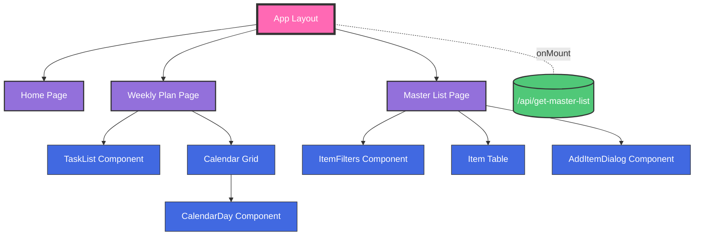

# Life Manager Design Document

## 1. Introduction

This document outlines the design for the Life Manager application, including data models, API endpoints, and other key considerations.

This app helps the user manage tasks, goals, planning, and productivity. 


## 2. System Architecture

### 2.1 Technology Stack

Frontend: React, NextJS, TailwindCSS, Shadcn Components
Backend: Python, Flask
Database: CosmosDB


## Frontend Architecture




## 2. Weekly Plan Page

The Weekly Plan page provides a weekly calendar view where users can schedule tasks. It allows users to visualize their week and manage their time effectively.

**Functionality:**
 
*   **Calendar Display:** The main view is a weekly calendar with a 7-day grid layout, starting from the week of the selected date.
*   **Week Navigation:** Users can navigate between weeks using "Previous Week" and "Next Week" buttons. The default view is the current week.
*   **Task List:** A fixed-width (280px) sidebar displays unscheduled tasks from the master list that are either "Not Started" or "Working On It".
*   **Drag and Drop:** Users can:
    - Drag tasks from the task list onto specific days in the calendar
    - Drag tasks between different days in the calendar
    - Drag tasks back to the task list to unschedule them
*   **Task Completion:** Tasks can be marked as complete directly from the calendar with an animated checkbox.
*   **Task Display:** Each task card shows:
    - Task title
    - Priority badge with color coding
    - Remove button (appears on hover)
    - Completion checkbox

**User Interactions:**
 
*   **Week Navigation:** Users can navigate weeks using "Previous Week" and "Next Week" buttons in the header.
*   **Drag and Drop:**
    - Tasks can be dragged from the task list to any day
    - Tasks can be dragged between days
    - Tasks can be dragged back to the task list
*   **Task Actions:**
    - Click the checkbox to mark a task as complete (with animation)
    - Click the X button to remove a task from a day (returns to task list)
    - Hover over tasks to see additional actions

**Data Flow:**
 
1.  **Initial Load:** 
    - Fetches unscheduled tasks from `/api/get-master-list` with filters:
      - type=task
      - statuses=Not Started,Working On It
2.  **Task Scheduling:**
    - UI updates immediately when tasks are dragged
    - Tasks are removed from source (task list or calendar day)
    - Tasks are added to target day
3.  **Task Completion:**
    - UI shows completion animation
    - Task is removed from calendar after animation
    - Backend is updated via `/api/batch-update` to mark task as Complete
4.  **Error Handling:**
    - Loading states are shown during data fetches
    - Error messages are displayed if API calls fail

**Component Breakdown:**

*   **`WeeklyPlanPage` Component (`/weekly-plan/page.tsx`):**
    - Main container with flex layout
    - Manages all state and data flow
    - Handles week navigation and date calculations
    - Contains task list sidebar and calendar grid

*   **`TaskList` Component (`/components/weekly-plan/task-list.tsx`):**
    - Fixed-width sidebar (280px)
    - Displays unscheduled tasks
    - Handles drag and drop interactions
    - Shows loading and error states
    - Displays task cards with title, priority, and status

*   **`CalendarDay` Component (`/components/weekly-plan/calendar-day.tsx`):**
    - Represents a single day in the calendar
    - Handles drag and drop for tasks
    - Manages task completion animations
    - Displays task cards with completion UI

**Visual Design:**

*   **Layout:**
    - Full-height layout with fixed sidebar
    - 7-column grid for calendar days
    - Responsive design with proper overflow handling

*   **Task Cards:**
    - White background with subtle border
    - Hover effects for better interaction feedback
    - Priority badges with color coding
    - Animated completion checkbox
    - Hidden remove button that appears on hover

*   **Styling:**
    - Uses TailwindCSS for styling
    - Custom animations for task completion
    - Consistent spacing and typography
    - Color-coded priority and status badges
    - Drag and drop visual feedback with blue highlight

**State Management:**

*   **Local State:**
    - `selectedDate`: Current selected week
    - `unscheduledTasks`: Tasks in the sidebar
    - `weeklyTasks`: Map of date strings to task arrays
    - `loading`: Loading state for API calls
    - `error`: Error state for API calls
    - `completingTasks`: Set of task IDs being completed

3. Master List Page - Shows all items (tasks and goals). Ability to filter and sort. Ability to add new tasks and goals.
    
    **Functionality:**
    
    *   **Display:** The page displays a list of items (tasks and goals) in a tabular format. Each row represents an item, and columns display various fields such as title, notes, status, due date, created date, and priority.
    *   **Filtering:** Users can filter items by status (Not Started, Working On It, Complete) and type (task, goal).
    *   **Sorting:** Users can sort items by priority, due date, or created date in ascending or descending order.
    *   **Editing:** Users can edit the title, notes, status, due date, and priority of an item directly in the table.
    *   **Adding Items:** Users can add new items (tasks or goals) using a dialog.
    *   **Deleting Items:** Users can delete items from the list.
    *   **Saving Changes:** Users can save all changes made to items in a single batch operation.
    
    **User Interactions:**
    
    *   **Filter Panel:** A filter panel can be toggled to show or hide filtering options.
    *   **Status Selection:** Users can change the status of an item using a dropdown select.
    *   **Priority Selection:** Users can change the priority of an item using a dropdown select.
    *   **Editable Fields:** Users can click on editable fields (title, notes, due date) to edit them directly in the table.
    *   **Save Button:** A save button is enabled when there are pending changes. Clicking the save button sends all changes to the backend.
    *   **Add Item Button:** An add item button opens a dialog for creating new items.
    *   **Delete Button:** A delete button is available for each item to delete it.
    
    **Data Flow:**
    
    1.  **Initial Load:** When the page loads, it fetches all items from the backend API based on the current filter and sort settings.
    2.  **Filtering and Sorting:** When the user changes the filter or sort settings, the page fetches the updated list of items from the backend API.
    3.  **Editing:** When the user edits an item, the changes are stored in a local state.
    4.  **Saving Changes:** When the user clicks the save button, all pending changes are sent to the backend API in a single batch update request.
    5.  **Adding Items:** When the user adds a new item, the item is sent to the backend API, and the page fetches the updated list of items.
    6.  **Deleting Items:** When the user deletes an item, the item ID is sent to the backend API, and the page fetches the updated list of items.
    
    **Component Breakdown:**
    
    *   **`MasterList` Component:** The main component for the master list page. It manages the state of the items, filters, and pending changes. It also handles API interaction for fetching, updating, and deleting items.
    *   **`ItemFilters` Component:** A component for displaying and managing the filter options.
    *   **`EditableField` Component:** A reusable component for displaying and editing text, date, and other types of fields.
    *   **`StatusSelect` Component:** A reusable component for displaying and selecting the status of an item.
    *   **`PrioritySelect` Component:** A reusable component for displaying and selecting the priority of an item.
    *   **`AddItemDialog` Component:** A dialog for adding new items.
    
4. Sidebar - Navigation to different pages.

The main page will be blank for now. There will be a sidebar to navigate to the different pages.


## Project Structure

```
.
├── backend
│   ├── app.py
│   ├── cosmos_db.py
│   └── requirements.txt
└── frontend
    ├── .gitignore
    ├── components.json
    ├── eslint.config.mjs
    ├── next.config.ts
    ├── package-lock.json
    ├── package.json
    ├── postcss.config.mjs
    ├── public
    │   ├── branding
    │   │   ├── next.svg
    │   │   └── vercel.svg
    │   ├── icons
    │   │   ├── favicon.ico
    │   │   └── site.webmanifest
    │   └── images
    │       ├── file.svg
    │       ├── globe.svg
    │       └── window.svg
    ├── src
    │   ├── app
    │   │   ├── globals.css
    │   │   ├── home
    │   │   │   └── page.tsx
    │   │   ├── layout.tsx
    │   │   ├── master-list
    │   │   │   └── page.tsx
    │   │   ├── page.tsx
    │   │   ├── sidebar
    │   │   │   └── sidebar.tsx
    │   │   └── weekly-plan
    │   │       └── page.tsx
    │   └── components
    │       ├── items
    │       │   ├── add-item-dialog.tsx
    │       │   └── item-filters.tsx
    │       └── ui
    │           ├── badge.tsx
    │           ├── button.tsx
    │           ├── card.tsx
    │           ├── checkbox.tsx
    │           ├── dialog.tsx
    │           ├── input.tsx
    │           ├── label.tsx
    │           ├── select.tsx
    │           └── switch.tsx
    ├── tailwind.config.ts
    └── tsconfig.json
```


## Tech Stack

### Backend

- Python
- Flask

### Frontend

- React
- NextJS
- TailwindCSS Styling
- Shadcn Components
- Lucide Icons

### Database

- CosmosDB


## 3. Data Model

### Backend Data Models (Python/CosmosDB)

#### Task Document Schema
```
TaskDocument:
    id: string
    user_id: string
    type: "task" | "goal"
    title: string
    status: "not_started" | "working_on_it" | "complete"
    priority: int # 0-100
    dynamic_priority: int # 0-100
    notes: string, optional
    due_date: string, optional # ISO date string
    created_at: string # ISO date string
    updated_at: string # ISO date string
    category_id: string, optional
    subcategory_id: string, optional
    is_recurring: boolean, optional
    frequency_in_days: number, optional
    completion_history: Array of { completed_at: string, next_due_date: string }, optional
    goal_ids: Array<string>, optional # References to GoalDocuments if this task is part of one or more goals
}
```

#### Goal Document Schema
```
GoalDocument:
    id: string
    user_id: string
    type: "goal"
    title: string
    status: "not_started" | "working_on_it" | "complete"
    priority: int # 0-100
    dynamic_priority: int # 0-100
    notes: string, optional
    due_date: string, optional # ISO date string
    created_at: string # ISO date string
    updated_at: string # ISO date string
    category_id: string, optional
    subcategory_id: string, optional
    is_recurring: boolean, optional
    frequency_in_days: number, optional
    completion_history: Array of { completed_at: string, next_due_date: string }, optional
    target_date: string, optional # ISO date string
    associated_task_ids: Array<string>, optional # References to TaskDocuments that are part of this goal
}
```
    
    
    
#### Category Document Schema
```
CategoryDocument:
    id: string;
    user_id: string;
    name: string;
    color: string, optional
    subcategories: Array of { id: string, name: string }, optional
}
```

### Frontend Data Models

#### Task Item
```typescript
interface TaskItem {
    id: string;
    userId: string;
    type: "task" | "goal";
    title: string;
    status: "Not Started" | "Working on it" | "Complete";
    priority: number; // Keep the numerical priority
    displayPriority: "Very High" | "High" | "Medium" | "Low" | "Very Low"; // Add display priority
    notes?: string;
    dueDate?: string; // Formatted date string
    createdAt: string; // Formatted date string
    updatedAt: string; // Formatted date string
    categoryId?: string;
    subcategoryId?: string;
    isRecurring?: boolean;
    frequencyInDays?: number;
    completionHistory?: Array<{
        completedAt: string; // Formatted date string
        nextDueDate: string; // Formatted date string
    }>;
    goalIds?: string[]; // Array of goal IDs
}
```

#### Goal Item
```typescript
interface GoalItem {
    id: string;
    userId: string;
    type: "goal";
    title: string;
    status: "Not Started" | "Working on it" | "Complete";
    priority: number; // Keep the numerical priority
    displayPriority: "Very High" | "High" | "Medium" | "Low" | "Very Low"; // Add display priority
    notes?: string;
    dueDate?: string; // Formatted date string
    createdAt: string; // Formatted date string
    updatedAt: string; // Formatted date string
    categoryId?: string;
    subcategoryId?: string;
    isRecurring?: boolean;
    frequencyInDays?: number;
    completionHistory?: Array<{
        completedAt: string; // Formatted date string
        nextDueDate: string; // Formatted date string
    }>;
    targetDate?: string; // Formatted date string
    taskIds?: string[]; // Array of task IDs
}
```
    

#### Category Item
```typescript
interface CategoryItem {
    id: string;
    userId: string;
    name: string;
    color?: string;
    subcategories?: Array<{
        id: string;
        name: string;
    }>;
}
```

### Mapping Functions

The backend handles all case conversions between snake_case (Python/backend) and camelCase (TypeScript/frontend) and hardcoded display values ("Not Started", "Working On It", "Complete"). The frontend always works with camelCase or display values, while the backend internally uses snake_case and handles conversions.

#### Case Conversion Functions

```python
def to_snake_case(data: dict) -> dict:
    """Convert a dictionary's keys from camelCase to snake_case recursively."""

def to_camel_case(data: dict) -> dict:
    """Convert a dictionary's keys from snake_case to camelCase recursively."""
```

These utility functions handle all case conversions between the frontend and backend:
- `to_snake_case`: Converts incoming frontend payloads from camelCase to snake_case
- `to_camel_case`: Converts outgoing backend responses from snake_case to camelCase

Both functions handle nested dictionaries and arrays automatically.

#### Usage in API Endpoints

1. **Incoming Requests (Frontend → Backend)**
   - All incoming request data is automatically converted from camelCase to snake_case using `to_snake_case()`
   - Example: `userId` → `user_id`, `dueDate` → `due_date`

2. **Database Operations**
   - All data is stored in snake_case format in CosmosDB
   - Internal backend operations use snake_case consistently

3. **Outgoing Responses (Backend → Frontend)**
   - All outgoing response data is converted from snake_case to camelCase using `to_camel_case()`
   - Example: `user_id` → `userId`, `due_date` → `dueDate`

4. **Special Handling**
   - Status values are stored in snake_case internally (`not_started`, `working_on_it`, `complete`)
   - Status values are converted to Title Case for frontend display ("Not Started", "Working on it", "Complete")
   - Priority values maintain their format ("Very High", "High", etc.) but are mapped to numeric values internally

This approach ensures:
- Consistent data format in the database (snake_case)
- Consistent data format in the frontend (camelCase)
- Automatic conversion at API boundaries
- No manual conversion needed in frontend code
- Proper handling of nested objects and arrays

### Data Transfer Contract

The data models defined above, along with the case conversion functions, form the contract between the frontend and backend. The frontend can always expect camelCase keys in responses, and should always send camelCase keys in requests. The backend handles all necessary conversions.
    
    

## 3. UI Constants

### Priority Colors
```css
Very High: #E84B3C
High: #F5B800
Medium: #808080
Low: #00DE94
Very Low: #B0B0B0
```
    

### Status Colors
```css
Not Started: #808080
Working on it: #F5B800
Complete: #00DE94
```
    

## 4. API Endpoints

### GET /api/get-master-list
Retrieves the master list of items with optional filtering and sorting.

Query Parameters:
- `statuses`: Comma-separated list of status values to filter by
- `sortBy`: Field to sort by (priority, dueDate, createdAt)
- `sortDirection`: Sort direction (asc, desc)
- `type`: Filter by item type (task, goal)

### GET /api/get-weekly-items
Retrieves the list of items for the current week with optional filtering and sorting.

Query Parameters:
- `statuses`: Comma-separated list of status values to filter by
- `sortBy`: Field to sort by (priority)
- `sortDirection`: Sort direction (asc, desc)
- `type`: Filter by item type (task, goal)
- `startDate`: ISO date string for the start of the week
- `endDate`: ISO date string for the end of the week

### GET /api/items/{id}
Retrieves a single item by its ID.

### PATCH /api/batch-update
Updates multiple items in a single request.

Request Body:
```typescript
{
    updates: Array<{
        id: string;
        [field: string]: any;
    }>;
}
```
    
A maximum of 100 items can be updated in a single batch request. If one update in the batch fails, the entire batch will be rolled back.

### POST /api/items
Creates a new item.

Request Body: Task or Goal document (without id, createdAt, updatedAt)

### DELETE /api/items/{id}
Deletes a single item by its ID.

### POST /api/categories
Creates a new category.

### GET /api/categories
Retrieves all categories.

### GET /api/categories/{id}
Retrieves a single category by its ID.

### PATCH /api/categories/{id}
Updates a category.

### DELETE /api/categories/{id}
Deletes a category.

## 5. Error Handling

API endpoints will return appropriate HTTP status codes (e.g., 400 for bad requests, 404 for not found, 500 for server errors). Error responses will be in JSON format with an error message.

## 6. Authentication and Authorization

Authentication will be handled using JWT (JSON Web Tokens). Authorization will be based on user roles and permissions.

## 7. Filtering and Sorting

Filters are applied using exact matches for status and type. Sorting is done based on the selected field and direction.

## 8. Recurring Tasks

When a recurring task is completed, a new instance of the task is created with a new due date based on the `frequencyInDays`. The `completionHistory` is updated with the completion date and the next due date.

## 9. Milestones

There is no limit on the number of milestones for a goal. Milestones have the same status values as tasks and goals.

## 10. Other Considerations

*   The `updatedAt` field is automatically updated on every change to the document.
*   IDs are generated using UUIDs (version 4).
*   Batch update limits and behavior
