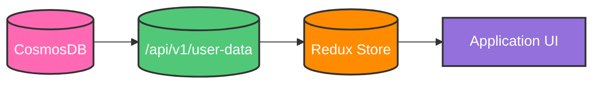
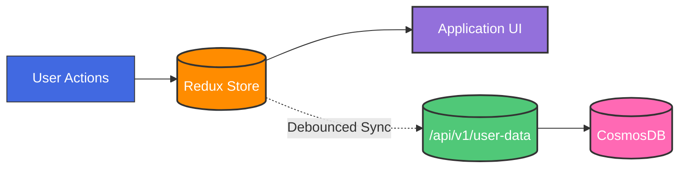
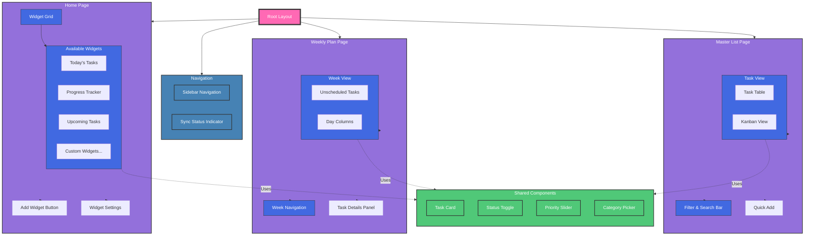

# Life Manager Design Document

## Table of Contents

1. [Core Architecture](#core-architecture)
   - [Technology Stack](#technology-stack)
   - [State Management](#state-management)
   - [Data Flow & Sync Strategy](#data-flow--sync-strategy)

2. [Data Models](#data-models)
   - [Frontend Data Models (TypeScript)](#frontend-data-models-typescript)
     - [Interface Usage Guidelines](#interface-usage-guidelines)
     - [Common Types](#common-types)
     - [Task Interface](#task-interface)
     - [Goal Interface](#goal-interface)
     - [Category Interface](#category-interface)
     - [Dashboard Interface](#dashboard-interface)
     - [Display Mappings](#display-mappings)
   - [Backend Data Models (CosmosDB)](#backend-data-models-cosmosdb)

3. [APIs](#apis)
   - [Base URL](#base-url)
   - [Authentication](#authentication)
   - [Common Response Format](#common-response-format)
   - [Error Codes](#error-codes)
   - [Core Endpoints](#core-endpoints)
   - [Rate Limiting](#rate-limiting)

4. [Features & Implementation](#features--implementation)
   - [Home Page](#home-page)
     - [Core Components](#core-components)
     - [Available Widgets](#available-widgets)
     - [Widget Management](#widget-management)
   - [Weekly Plan Page](#weekly-plan-page)
     - [Core Components](#core-components-1)
     - [Interactions](#interactions)
     - [State Management](#state-management)
     - [Performance Optimizations](#performance-optimizations)
     - [Error Handling](#error-handling)
   - [Master List Page](#master-list-page)
     - [Page Layout](#page-layout)
     - [State Management](#state-management-1)
     - [Performance Optimizations](#performance-optimizations-1)
     - [Error Handling](#error-handling-1)


## Core Architecture

### Technology Stack
- Frontend: React, NextJS, TailwindCSS, Shadcn Components, Redux Toolkit
- Backend: Python, Flask
- Database: CosmosDB

### State Management

#### Global State (Redux)
All persistent data lives in Redux, serving as the single source of truth for the application. This includes:

1. **User Data**
   - Tasks
   - Goals
   - Categories
   - Dashboard configuration

2. **Application State**
   - Sync status
   - Last sync timestamp
   - Error states
   - User preferences

3. **Store Structure**
```typescript
interface RootState {
    tasks: {
        items: Record<UUID, Task>;
        loading: boolean;
        error: string | null;
    };
    goals: {
        items: Record<UUID, Goal>;
        loading: boolean;
        error: string | null;
    };
    categories: {
        items: Record<UUID, Category>;
        loading: boolean;
        error: string | null;
    };
    dashboard: {
        widgets: DashboardWidget[];
        loading: boolean;
        error: string | null;
    };
    sync: {
        status: 'idle' | 'syncing' | 'error';
        lastSynced: string | null;
        pendingChanges: number;
    };
}
```

#### Local State
Used only for temporary UI states within components:
- Form input values before submission
- Modal/dropdown open/closed states
- Component-specific loading states
- Any temporary data that doesn't need to persist

### Data Flow & Sync Strategy

#### User Login / Initial Load


#### User Interactions


#### 1. Initial Load
```typescript
// In _app.tsx or similar root component
const App = () => {
    const dispatch = useDispatch();

    useEffect(() => {
        const loadInitialData = async () => {
            try {
                dispatch(setLoading(true));
                const userData = await api.getUserData();
                dispatch(initializeStore(userData));
            } catch (error) {
                dispatch(setError(error.message));
            } finally {
                dispatch(setLoading(false));
            }
        };

        loadInitialData();
    }, []);

    return <AppContent />;
};
```

#### 2. State Updates
All state updates follow a consistent pattern using our `useStateSync` hook:

```typescript
type ChangeType = 'text' | 'status' | 'priority' | 'drag';

const SYNC_CONFIG: Record<ChangeType, { debounceMs: number }> = {
    text: { debounceMs: 1000 },      // Text input changes
    status: { debounceMs: 300 },     // Status toggles
    priority: { debounceMs: 500 },   // Priority adjustments
    drag: { debounceMs: 800 }        // Drag operations
};

export function useStateSync() {
    const dispatch = useDispatch();
    
    const handleChange = useCallback(<T extends { id: string }>(
        type: ChangeType,
        item: T,
        changes: Partial<T>
    ) => {
        // 1. Immediate Redux update
        dispatch({
            type: `${item.type}/update`,
            payload: { id: item.id, changes }
        });

        // 2. Debounced backend sync
        debouncedSync[type]({ id: item.id, ...changes });
    }, [dispatch]);

    return { handleChange };
}
```

#### 3. Component Integration
Components use the `useStateSync` hook for all data modifications:

```typescript
const TaskCard = ({ task }: { task: Task }) => {
    const { handleChange } = useStateSync();
    
    return (
        <div>
            <input
                value={task.title}
                onChange={e => handleChange('text', task, { 
                    title: e.target.value 
                })}
            />
            <StatusToggle
                status={task.status}
                onChange={status => handleChange('status', task, { 
                    status,
                    statusHistory: [
                        ...task.statusHistory,
                        { status, changedAt: new Date().toISOString() }
                    ]
                })}
            />
        </div>
    );
};
```

#### 4. Sync Status Management
A global sync indicator shows the current sync state:

```typescript
const SyncIndicator = () => {
    const syncState = useSelector((state: RootState) => state.sync);
    
    return (
        <div>
            {syncState.status === 'syncing' && (
                <Spinner size="sm" />
            )}
            {syncState.status === 'error' && (
                <ErrorIcon color="red" />
            )}
            {syncState.status === 'idle' && syncState.lastSynced && (
                <div className="text-sm text-gray-500">
                    Last saved: {formatTime(syncState.lastSynced)}
                </div>
            )}
        </div>
    );
};
```

#### 5. Error Handling
Failed sync operations are handled gracefully:

```typescript
const handleSyncError = async (error: Error, retryAttempt: number = 0) => {
    const MAX_RETRIES = 3;
    
    if (retryAttempt < MAX_RETRIES) {
        // Exponential backoff retry
        await new Promise(r => setTimeout(r, Math.pow(2, retryAttempt) * 1000));
        return performSync(retryAttempt + 1);
    }
    
    // After max retries, show error and provide manual retry option
    dispatch(setSyncError(error.message));
};
```

This architecture provides:
- Single source of truth in Redux
- Consistent state update pattern
- Optimistic updates with backend sync
- Clear sync status feedback
- Automatic error handling and retries
- Simple component integration

## Data Models

### Frontend Data Models (TypeScript)

#### Interface Usage Guidelines

1. **Strict Type Adherence**
   - All frontend components must strictly implement these interfaces
   - No extending interfaces without documentation and team review
   - No bypassing optional fields with type assertions (`!` or `as`)
   - All interface extensions must be backwards compatible

2. **State Management**
   - Redux store must maintain normalized data matching these interfaces
   - All API responses must be validated against these interfaces
   - No storing derived data that can be computed from interface fields
   - Use selectors for computing derived data

3. **Component Props**
   - Components should accept the smallest necessary subset of interfaces
   - Use TypeScript utility types to create precise prop interfaces:
     ```typescript
     // Good
     interface TaskTitleProps {
         task: Pick<Task, 'id' | 'title'>;
     }

     // Avoid
     interface TaskTitleProps {
         task: Task;  // Exposes unnecessary fields
     }
     ```
   - Document required vs optional props

4. **Modification Rules**
   - Interface changes require documentation update
   - Breaking changes must be versioned
   - Additions to interfaces must be optional fields
   - Update all relevant type definitions when modifying interfaces

#### Common Types
```typescript
type UUID = string;
type ISODateString = string;

type Status = 'notStarted' | 'workingOnIt' | 'complete';
type RecurrenceFrequency = 'daily' | 'weekly' | 'monthly' | 'yearly';
type TimeRange = 'day' | 'week' | 'month';
type WidgetType = 'todaysTasks' | 'progress' | 'upcomingTasks';

interface TimeTracking {
    estimatedMinutes?: number;
    actualMinutes?: number;
}

interface StatusHistoryEntry {
    status: Status;
    changedAt: ISODateString;
    notes?: string;
}

interface CompletionEntry {
    completedAt: ISODateString;
    completedBy: UUID;
    nextDueDate?: ISODateString;
    completionNotes?: string;
}

interface RecurrenceRule {
    frequency: RecurrenceFrequency;
    interval: number;
    endDate?: ISODateString;
    maxOccurrences?: number;
    daysOfWeek?: number[];  // 0-6 for weekly
    dayOfMonth?: number;    // 1-31 for monthly
    months?: number[];      // 1-12 for yearly
    weekOfMonth?: number;   // -1 to 5 (-1 for last)
}
```

#### Task Interface
```typescript
interface Task {
    id: UUID;
    userId: UUID;
    type: 'task';
    title: string;
    status: Status;
    priority: number;
    dynamicPriority: number;
    effort?: number;
    notes?: string;
    dueDate?: ISODateString;
    scheduledDate?: ISODateString;
    createdAt: ISODateString;
    updatedAt: ISODateString;
    categoryId?: UUID;
    subcategoryId?: UUID;
    
    statusHistory: StatusHistoryEntry[];
    completionHistory: CompletionEntry[];
    timeTracking?: TimeTracking;
    
    recurrence?: {
        isRecurring: boolean;
        rule?: RecurrenceRule;
    };
    
    tags?: string[];
    
    dependencies?: {
        blockedBy?: UUID[];
        blocks?: UUID[];
    };
    
    relationships?: {
        goalIds?: UUID[];
    };
}
```

#### Goal Interface
```typescript
interface Goal {
    id: UUID;
    userId: UUID;
    type: 'goal';
    title: string;
    status: Status;
    priority: number;
    dynamicPriority: number;
    effort?: number;
    notes?: string;
    categoryId?: UUID;
    subcategoryId?: UUID;
    createdAt: ISODateString;
    updatedAt: ISODateString;
    
    measurement?: {
        targetValue?: number;
        currentValue?: number;
        measureUnit?: string;
    };
    
    timeline: {
        startDate?: ISODateString;
        targetDate: ISODateString;
    };
    
    relationships?: {
        parentGoalId?: UUID;
        childGoalIds?: UUID[];
        taskIds?: UUID[];
    };
    
    progressHistory: {
        date: ISODateString;
        value: number;
        notes?: string;
    }[];
}
```

#### Category Interface
```typescript
interface Category {
    id: UUID;
    userId: UUID;
    name: string;
    color?: string;
    parentId?: UUID;
    
    organization: {
        icon?: string;
        displayOrder: number;
    };
    
    subcategories: {
        id: UUID;
        name: string;
        description?: string;
        color?: string;
        icon?: string;
        displayOrder: number;
    }[];
    
    description?: string;
    
    statistics?: {
        totalItems?: number;
        completedItems?: number;
        averageCompletionTime?: number;
    };
}
```

#### Dashboard Interface
```typescript
interface DashboardWidget {
    id: UUID;
    type: 'todaysTasks' | 'progress' | 'upcomingTasks';
    position: number;
    config: {
        title?: string;
        timeRange?: 'day' | 'week' | 'month';
    };
}

interface Dashboard {
    id: UUID;
    userId: UUID;
    widgets: DashboardWidget[];
}
```


## Display Mappings

### Status Display Mapping
```typescript
const STATUS_DISPLAY = {
    notStarted: 'Not Started',
    workingOnIt: 'Working on It',
    complete: 'Complete'
};

const STATUS_COLORS = {
    notStarted: 'gray.500',
    workingOnIt: 'yellow.500',
    complete: 'green.500'
};
```

### Priority Display Mapping
```typescript
const PRIORITY_DISPLAY = {
    ranges: [
        { min: 80, label: 'Very High', color: 'red.500' },
        { min: 60, label: 'High', color: 'orange.500' },
        { min: 40, label: 'Medium', color: 'yellow.500' },
        { min: 20, label: 'Low', color: 'green.500' },
        { min: 0, label: 'Very Low', color: 'green.250' }
    ]
};
```

### Effort Display Mapping
```typescript
const EFFORT_DISPLAY = {
    1: 'Very Low',
    2: 'Low',
    3: 'Medium',
    4: 'High',
    5: 'Very High'
};
```

### Time Range Display Mapping
```typescript
const TIME_RANGE_DISPLAY = {
    day: 'Daily',
    week: 'Weekly',
    month: 'Monthly'
};
```


### Backend Data Models (CosmosDB)

All variable names are in snake_case. Each document type is stored in its own container in CosmosDB.

#### Task Document
```json
{
    // Metadata
    "id": "string (UUID)",
    "user_id": "string (UUID)",
    "type": "task",
    "partition_key": "string (user_id)",
    
    // Core Fields
    "title": "string",
    "status": "string (enum: not_started, working_on_it, complete)",
    "priority": "number (0-100)",
    "dynamic_priority": "number (0-100)",
    "effort": "number (1-5, optional)",
    "notes": "string (optional)",
    
    // Dates
    "due_date": "string (ISO date, optional)",
    "scheduled_date": "string (ISO date, optional)",
    "created_at": "string (ISO date)",
    "updated_at": "string (ISO date)",
    
    // Categories
    "category_id": "string (UUID, optional)",
    "subcategory_id": "string (UUID, optional)",
    
    // History Tracking
    "status_history": [
        {
            "status": "string (enum: not_started, working_on_it, complete)",
            "changed_at": "string (ISO date)",
            "notes": "string (optional)"
        }
    ],
    "completion_history": [
        {
            "completed_at": "string (ISO date)",
            "completed_by": "string (UUID)",
            "next_due_date": "string (ISO date, optional)",
            "completion_notes": "string (optional)"
        }
    ],
    
    // Time Management
    "time_tracking": {
        "estimated_minutes": "number (optional)",
        "actual_minutes": "number (optional)"
    },
    
    // Recurrence
    "recurrence": {
        "is_recurring": "boolean",
        "rule": {
            "frequency": "string (enum: daily, weekly, monthly, yearly)",
            "interval": "number",
            "end_date": "string (ISO date, optional)",
            "max_occurrences": "number (optional)",
            "days_of_week": "number[] (0-6, optional)",
            "day_of_month": "number (1-31, optional)",
            "months": "number[] (1-12, optional)",
            "week_of_month": "number (-1 to 5, optional)"
        }
    },
    
    // Relationships
    "tags": "string[] (optional)",
    "dependencies": {
        "blocked_by": "string[] (task UUIDs, optional)",
        "blocks": "string[] (task UUIDs, optional)"
    },
    "relationships": {
        "goal_ids": "string[] (goal UUIDs, optional)"
    }
}
```

#### Goal Document
```json
{
    // Metadata
    "id": "string (UUID)",
    "user_id": "string (UUID)",
    "type": "goal",
    "partition_key": "string (user_id)",
    
    // Core Fields
    "title": "string",
    "status": "string (enum: not_started, working_on_it, complete)",
    "priority": "number (0-100)",
    "dynamic_priority": "number (0-100)",
    "effort": "number (1-5, optional)",
    "notes": "string (optional)",
    
    // Categories
    "category_id": "string (UUID, optional)",
    "subcategory_id": "string (UUID, optional)",
    
    // Dates
    "created_at": "string (ISO date)",
    "updated_at": "string (ISO date)",
    
    // Measurement
    "measurement": {
        "target_value": "number (optional)",
        "current_value": "number (optional)",
        "measure_unit": "string (optional)"
    },
    
    // Timeline
    "timeline": {
        "start_date": "string (ISO date, optional)",
        "target_date": "string (ISO date)"
    },
    
    // Relationships
    "relationships": {
        "parent_goal_id": "string (UUID, optional)",
        "child_goal_ids": "string[] (goal UUIDs, optional)",
        "task_ids": "string[] (task UUIDs, optional)"
    },
    
    // Progress
    "progress_history": [
        {
            "date": "string (ISO date)",
            "value": "number",
            "notes": "string (optional)"
        }
    ]
}
```

#### Category Document
```json
{
    // Metadata
    "id": "string (UUID)",
    "user_id": "string (UUID)",
    "partition_key": "string (user_id)",
    
    // Core Fields
    "name": "string",
    "color": "string (optional)",
    "parent_id": "string (UUID, optional)",
    "description": "string (optional)",
    
    // Organization
    "organization": {
        "icon": "string (optional)",
        "display_order": "number"
    },
    
    // Subcategories
    "subcategories": [
        {
            "id": "string (UUID)",
            "name": "string",
            "description": "string (optional)",
            "color": "string (optional)",
            "icon": "string (optional)",
            "display_order": "number"
        }
    ],
    
    // Analytics
    "statistics": {
        "total_items": "number (optional)",
        "completed_items": "number (optional)",
        "average_completion_time": "number (optional)"
    }
}
```

#### Dashboard Document
```json
{
    // Metadata
    "id": "string (UUID)",
    "user_id": "string (UUID)",
    "partition_key": "string (user_id)",
    
    // Widgets Configuration
    "widgets": [
        {
            "id": "string (UUID)",
            "type": "string (enum: todays_tasks, progress, upcoming_tasks)",
            "position": "number",
            "config": {
                "title": "string (optional)",
                "time_range": "string (enum: day, week, month, optional)"
            }
        }
    ]
}
```


### APIs

The backend provides a RESTful API that serves as a data persistence layer. All endpoints require authentication via a Bearer token.

#### Base URL
```http
/api/v1
```

#### Authentication
All requests must include an Authorization header:
```http
Authorization: Bearer <token>
```

#### Common Response Format
```typescript
interface ApiResponse<T> {
    success: boolean;
    data?: T;
    error?: {
        code: string;
        message: string;
        details?: any;
    };
}
```

#### Error Codes
- `AUTH_ERROR`: Authentication/authorization errors
- `VALIDATION_ERROR`: Invalid input data
- `NOT_FOUND`: Requested resource not found
- `SERVER_ERROR`: Internal server error

#### Core Endpoints

##### Get All User Data
```http
GET /user-data
```

Returns all data for the authenticated user in a single request. This is the primary endpoint used on initial app load.

Response:
```typescript
interface UserData {
    tasks: Task[];
    goals: Goal[];
    categories: Category[];
    dashboard: Dashboard;
}
```

Response Type: `ApiResponse<UserData>`

##### Update Dashboard
```http
PUT /dashboard
```

Updates the dashboard widget configuration.

Request Body:
```typescript
interface DashboardUpdate {
    widgets: {
        id: string;
        type: 'todaysTasks' | 'progress' | 'upcomingTasks';
        position: number;
        config: {
            title?: string;
            timeRange?: 'day' | 'week' | 'month';
        };
    }[];
}
```

Response Type: `ApiResponse<Dashboard>`

#### Rate Limiting
- 100 requests per minute per user
- Rate limit headers included in all responses:
```http
X-RateLimit-Limit: 100
X-RateLimit-Remaining: 95
X-RateLimit-Reset: 1635789600
```


##Features & Implementation



### Home Page 

The home page is the main landing page of the app. It is the default and first page on the sidebar. The goal of the home page is to provide an overview/summary from all the other pages/components/features of the application. 

#### Components

1. **Widget Grid** - The main component of the home page is a grid of widgets that display information from the other pages/components/features of the application. 
2. **Add Widget Button** - Located in the top right of the page. 
3. **Widget** - A component that displays information from the other pages/components/features of the application. It can be added to the widget grid, removed from the widget grid, and edited. What can be edited are specific to the widget. 

#### Available Widgets

1. **Today's Tasks** - Shows tasks that are on today's day for the weekly plan. Shows "No tasks scheduled for today" if there are no tasks scheduled for today, along with a number in the top right corner of the widget. 
2. **Progress** - Shows the progress of the goals and tasks for the (week, month, year, etc). 
3. **Upcoming Tasks** - Shows tasks that are upcoming for the next (week, month, year, etc). 

### Weekly Plan Page

The Weekly Plan page provides a calendar-style view for planning and managing tasks on a weekly basis. Following our frontend-driven architecture, all data manipulation happens client-side with eventual consistency to the backend.

#### Core Components

1. **Week Header**
   - Week date range display (e.g., "Dec 29 - Jan 4, 2025")
   - Navigation buttons (Previous Week, Next Week)
   - Current week indicator

2. **Task List**
   - Sidebar showing all unscheduled tasks
   - Tasks grouped by priority
   - Drag and drop enabled
   - Shows task priority and status indicators
   - Quick actions (mark complete, edit)

3. **Weekly Calendar Grid**
   - 7-day view with date headers
   - Drop zones for task scheduling
   - Visual indicators for weekends
   - Tasks displayed with priority colors
   - Drag and drop between days
   - Empty state message: "Drop tasks here"

#### Interactions

1. **Task Scheduling**
   - Drag tasks from task list to calendar days
   - Drag tasks between days
   - Updates task's `scheduled_date` in frontend state
   - Optimistic UI updates
   - Background sync to backend

2. **Task Status Updates**
   - Click to toggle task status
   - Updates reflected immediately in UI
   - Status change recorded in `status_history`
   - Optimistic updates with error handling

3. **Week Navigation**
   - Previous/Next week buttons
   - All data already in frontend memory
   - Instant UI updates
   - No additional API calls needed

#### State Management

1. **Local State**
```typescript
interface WeeklyPlanState {
    selectedWeek: {
        startDate: ISODateString;
        endDate: ISODateString;
    };
    draggedTask?: UUID;
    expandedDays: UUID[];  // days with expanded task details
}
```

2. **Change Management**
```typescript
// Using the global SmartDebounceManager for all updates
const handleTaskScheduleChange = (taskId: UUID, newDate: ISODateString) => {
    smartDebounceManager.handleChange(
        'DRAG_OPERATION',  // Uses 800ms delay
        taskId,
        { scheduled_date: newDate }
    );
};

const handleStatusChange = (taskId: UUID, newStatus: Status) => {
    const timestamp = new Date().toISOString();
    const statusHistoryEntry = {
        status: newStatus,
        changedAt: timestamp,
    };
    
    smartDebounceManager.handleChange(
        'STATUS_CHANGE',  // Uses 300ms delay
        taskId,
        {
            status: newStatus,
            statusHistory: [...currentStatusHistory, statusHistoryEntry]
        }
    );
};

const handleTitleChange = (taskId: UUID, newTitle: string) => {
    smartDebounceManager.handleChange(
        'TEXT_INPUT',  // Uses 1000ms delay
        taskId,
        { title: newTitle }
    );
};

const handlePriorityChange = (taskId: UUID, newPriority: number) => {
    smartDebounceManager.handleChange(
        'PRIORITY_CHANGE',  // Uses 500ms delay
        taskId,
        { priority: newPriority }
    );
};
```

3. **Task Filtering**
```typescript
// Selector for unscheduled tasks
const getUnscheduledTasks = (state: RootState) => 
    state.tasks.filter(task => !task.scheduled_date);

// Selector for tasks on a specific date
const getTasksForDate = (state: RootState, date: ISODateString) =>
    state.tasks.filter(task => task.scheduled_date === date);
```

#### Display Components

1. **Task Card**
```typescript
interface TaskCardProps {
    task: Task;
    isDragging: boolean;
    showDetails: boolean;
    onStatusChange: (newStatus: Status) => void;
    onScheduleChange: (newDate: ISODateString) => void;
    onTitleChange: (newTitle: string) => void;
    onPriorityChange: (newPriority: number) => void;
}

const TaskCard = memo(({ task, ...props }: TaskCardProps) => {
    const handleTitleChange = useCallback((newTitle: string) => {
        smartDebounceManager.handleChange(
            'TEXT_INPUT',
            task.id,
            { title: newTitle }
        );
    }, [task.id]);

    const handleStatusToggle = useCallback((newStatus: Status) => {
        smartDebounceManager.handleChange(
            'STATUS_CHANGE',
            task.id,
            { 
                status: newStatus,
                statusHistory: [
                        ...task.statusHistory,
                        { status: newStatus, changedAt: new Date().toISOString() }
                    ]
            }
        );
    }, [task.id, task.statusHistory]);

    return (
        <div>
            <input
                value={task.title}
                onChange={e => handleChange('text', task, { 
                    title: e.target.value 
                })}
            />
            <StatusToggle
                status={task.status}
                onChange={status => handleChange('status', task, { 
                    status,
                    statusHistory: [
                        ...task.statusHistory,
                        { status, changedAt: new Date().toISOString() }
                    ]
                })}
            />
        </div>
    );
});
```

2. **Day Column**
```typescript
interface DayColumnProps {
    date: ISODateString;
    tasks: Task[];
    isWeekend: boolean;
    isToday: boolean;
    onDrop: (taskId: UUID) => void;
}

const DayColumn = memo(({ date, tasks, onDrop }: DayColumnProps) => {
    const handleDrop = useCallback((taskId: UUID) => {
        smartDebounceManager.handleChange(
            'DRAG_OPERATION',
            taskId,
            { scheduled_date: date }
        );
    }, [date]);

    return (
        // Component JSX
    );
});
```

#### Styling

1. **Priority Colors**
```typescript
// Reusing PRIORITY_DISPLAY from display mappings
const getTaskColor = (priority: number) => {
    const range = PRIORITY_DISPLAY.ranges.find(r => priority >= r.min);
    return range?.color || 'gray.500';
};
```

2. **Status Indicators**
```typescript
// Reusing STATUS_DISPLAY and STATUS_COLORS from display mappings
const getStatusStyle = (status: Status) => ({
    label: STATUS_DISPLAY[status],
    color: STATUS_COLORS[status]
});
```

#### Performance Optimizations

1. **Virtualization**
```typescript
// Virtualized list for better performance with large datasets
interface VirtualizedTaskListProps {
    tasks: Task[];
    windowSize: number;  // Only render visible items plus buffer
    itemHeight: number;  // Fixed height for viewport calculations
}

const VirtualizedTaskList = memo(({ tasks, windowSize, itemHeight }: VirtualizedTaskListProps) => {
    // Component implementation
});
```

Key Features:
- Use virtualization for task list when exceeds 50 items
- Only render visible items plus buffer
- Fixed height calculations for smooth scrolling

2. **Efficient State Updates**
```typescript
// Cache expensive calculations
const getTasksByPriority = createSelector(
    [getTasks],
    (tasks) => ({
        high: tasks.filter(t => t.priority >= 80),
        medium: tasks.filter(t => t.priority >= 40 && t.priority < 80),
        low: tasks.filter(t => t.priority < 40)
    })
);

// Example of using SmartDebounceManager for priority updates
const PrioritySlider = memo(({ taskId, priority }: { taskId: UUID; priority: number }) => {
    const handlePriorityChange = useCallback((newPriority: number) => {
        smartDebounceManager.handleChange(
            'PRIORITY_CHANGE',
            taskId,
            { priority: newPriority }
        );
    }, [taskId]);

    return (
        // Slider component JSX
    );
});
```

Key Features:
- Memoized selectors for efficient filtering
- Proper debouncing for UI interactions
- Optimistic updates for immediate feedback

3. **Rendering Optimizations**
```typescript
// Prevent unnecessary re-renders with proper memoization
const TaskCard = memo(({ task, onStatusChange }: TaskCardProps) => {
    const handleTitleChange = useCallback((newTitle: string) => {
        smartDebounceManager.handleChange(
            'TEXT_INPUT',
            task.id,
            { title: newTitle }
        );
    }, [task.id]);

    const handleStatusToggle = useCallback((newStatus: Status) => {
        smartDebounceManager.handleChange(
            'STATUS_CHANGE',
            task.id,
            { 
                status: newStatus,
                statusHistory: [...task.statusHistory, {
                    status: newStatus,
                    changedAt: new Date().toISOString()
                }]
            }
        );
    }, [task.id, task.statusHistory]);

    return (
        // Component JSX
    );
}, (prevProps, nextProps) => 
    prevProps.task.id === nextProps.task.id &&
    prevProps.task.status === nextProps.task.status &&
    prevProps.task.title === nextProps.task.title
);

// Load heavy components only when needed
const TaskDetails = lazy(() => import('./TaskDetails'));
```

Key Features:
- Proper component memoization
- Callback memoization with correct dependencies
- Lazy loading for better initial load time
- Consistent use of SmartDebounceManager for all updates

#### Error Handling

1. **Sync Failures**
   - Retry failed updates up to 3 times
   - Visual indicator for sync status
   - Revert optimistic updates on failure
   - Error message in UI

2. **Invalid States**
   - Prevent dragging to invalid dates
   - Validate all user inputs
   - Handle concurrent updates gracefully

#### Task Completion Animation

```typescript
interface CheckmarkAnimationProps {
    isCompleted: boolean;
    size?: 'sm' | 'md' | 'lg';
    onAnimationComplete?: () => void;
}

// Smooth animation using Framer Motion
const checkmarkVariants = {
    hidden: { pathLength: 0, opacity: 0 },
    visible: {
        pathLength: 1,
        opacity: 1,
        transition: {
            pathLength: { duration: 0.2, ease: "easeInOut" },
            opacity: { duration: 0.1 }
        }
    }
};
```

- Satisfying checkmark animation sequence (circle → checkmark → fade)
- Haptic feedback on mobile devices
- Success sound (if enabled)
- Celebration effects for important tasks and achievements
- Spring animation for task card removal


### Master List Page

The Master List page provides a centralized view of all tasks and goals, following our frontend-driven architecture. All filtering, sorting, and updates happen client-side with eventual consistency to the backend.

#### Page Layout

1. **Page Header**
   - Left: Page title "Master List"
   - Right:
     - Filter toggle button (≡)
     - Add Item button (opens shared item creation dialog)

2. **Filter Bar** (collapsible)
   - Filter sections:
     - Status: Clickable pills that highlight when selected (multi-select)
     - Sort By dropdown
     - Sort Direction dropdown
     - Type filter dropdown
   - Uses same animation system as other components
   - Search by title/description (uses TEXT_INPUT debounce setting)
   - Filter dropdowns:
     - Priority (using PRIORITY_DISPLAY ranges)
     - Category (from user's categories)
     - Due Date Range
   - Sort by any column (persisted in user preferences)

3. **Main Table/Grid Component**
   - Core component of the page
   - Unified view of tasks and goals using virtualized list
   - Columns:
     - Status (uses STATUS_DISPLAY mapping + checkmark animation)
     - Title (editable with TEXT_INPUT debounce)
     - Priority (uses PRIORITY_DISPLAY mapping with PRIORITY_CHANGE debounce)
     - Due Date (optional)
     - Category (uses category.color for visual indicator)
     - Created On
     - Notes (editable with TEXT_INPUT debounce)
   - Quick inline editing using SmartDebounceManager for optimistic updates
   - Delete action per row (immediate with optimistic update)

#### Status Interaction

The status column combines two interaction patterns:
1. A clickable status text that cycles through non-complete statuses
2. A checkbox/checkmark for completion

A. **Status Text Interaction**
   - Clicking the status text cycles through: "Not Started" → "Working On It" → "Not Started"
   - Text color matches STATUS_DISPLAY mapping
   - Simple fade transition between states
   - No dropdown needed for these state changes

B. **Completion Interaction**
   - Separate checkbox to the left of the status text
   - Uses the checkmark animation when completing
   - Clicking checkbox when complete reverts to previous non-complete status
   - Same animation/feedback as Weekly Plan:
     - Haptic feedback (on mobile)
     - Success sound (if enabled)
     - Celebration effects for important tasks

```typescript
interface StatusCellProps {
    item: Task | Goal;
    onStatusChange: (newStatus: Status) => void;
}

const StatusCell = memo(({ item, onStatusChange }: StatusCellProps) => {
    const cycleStatus = () => {
        if (item.status === 'complete') return; // Don't cycle if complete
        const nextStatus = item.status === 'notStarted' ? 'workingOnIt' : 'notStarted';
        onStatusChange(nextStatus);
    };

    const toggleComplete = () => {
        if (item.status === 'complete') {
            // Revert to previous non-complete status or default to notStarted
            onStatusChange(item.statusHistory[1]?.status || 'notStarted');
        } else {
            onStatusChange('complete');
        }
    };

    return (
        <div className="flex items-center gap-2">
            <CheckmarkAnimation
                isCompleted={item.status === 'complete'}
                onComplete={toggleComplete}
                size="sm"
            />
            <button
                onClick={cycleStatus}
                className={`px-2 py-1 rounded ${getStatusColor(item.status)}`}
                disabled={item.status === 'complete'}
            >
                {STATUS_DISPLAY[item.status]}
            </button>
        </div>
    );
});
```

#### State Management

```typescript
interface MasterListState {
    filters: {
        search: string;
        status: Status[];  // Selected status pills
        categories?: UUID[];
        priorityRange?: {
            min: number;
            max: number;
        };
        dateRange?: {
            start: ISODateString;
            end: ISODateString;
        };
    };
    sort: {
        column: keyof Task | keyof Goal;
        direction: 'asc' | 'desc';
    };
    view: {
        filterBarExpanded: boolean;
    };
    pendingChanges: boolean;  // For Save Changes button
}

// Status pill selection
interface StatusPill {
    status: Status;
    selected: boolean;
    onClick: () => void;
}
```

#### Performance Optimizations

1. **Virtualized List**
   - Uses same virtualization pattern as Weekly Plan page
   - Only renders visible rows plus buffer
   - Smooth scrolling with row height estimation

2. **State Updates**
```typescript
// Example of using SmartDebounceManager for Master List updates
const MasterListRow = memo(({ item }: { item: Task | Goal }) => {
    const handleTitleChange = useCallback((newTitle: string) => {
        smartDebounceManager.handleChange(
            'TEXT_INPUT',  // Uses 1000ms delay
            item.id,
            { title: newTitle }
        );
    }, [item.id]);

    const handleStatusChange = useCallback((newStatus: Status) => {
        const statusHistoryEntry = {
            status: newStatus,
            changedAt: new Date().toISOString()
        };
        
        smartDebounceManager.handleChange(
            'STATUS_CHANGE',  // Uses 300ms delay
            item.id,
            {
                status: newStatus,
                statusHistory: [...item.statusHistory, statusHistoryEntry]
            }
        );
    }, [item.id, item.statusHistory]);

    const handlePriorityChange = useCallback((newPriority: number) => {
        smartDebounceManager.handleChange(
            'PRIORITY_CHANGE',  // Uses 500ms delay
            item.id,
            { priority: newPriority }
        );
    }, [item.id]);

    return (
        // Row component JSX
    );
});
```

3. **Memoized Components**
```typescript
const TableRow = memo(({ item }: { item: Task | Goal }) => {
    // Render optimized row with SmartDebounceManager handlers
}, (prev, next) => {
    // Deep equality check on relevant props
    return prev.item.id === next.item.id &&
           prev.item.updatedAt === next.item.updatedAt;
});
```

#### Error Handling

- Uses same error handling patterns as other pages
- Optimistic updates with rollback capability
- Visual feedback for sync status
- Retry logic for failed operations
- Validation using shared validation functions


