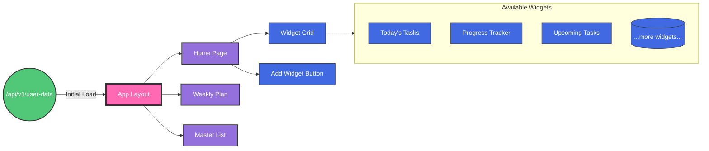

# Life Manager Design Document

## Core Architecture

### Technology Stack
- Frontend: React, NextJS, TailwindCSS, Shadcn Components
- Backend: Python, Flask
- Database: CosmosDB

### Application Structure




### Key Architectural Decisions

1. **Frontend-Driven Architecture**
   - Load all user data on initial page load
   - Keep all user data in frontend memory 
   - Process all view-specific logic in frontend
   - Minimizes API calls and provides instant UI updates

2. **Frontend State Management**
   - Use Redux as global state management
   - Store normalized data (tasks, goals, categories by ID)
   - Implement optimistic updates for better UX
   - Frontend maintains single source of truth
   - Components access data through selectors
   - State updates trigger automatic UI updates

3. **Data Flow**
   - Initial Load: Single API call fetches all user data using userId as partition key
   - Frontend Data Updates:
     1. Update Redux store immediately
     2. UI updates instantly
     3. Send update to backend
     4. Handle any errors/rollbacks if needed
   - All filtering and calculations happen client-side

4. **API Design**
   - Simple CRUD operations only
   - Backend serves as data persistence layer
   - Minimal business logic in backend
   - Optimized for single-user data access

## Data Models

### Frontend Data Models (TypeScript)

#### Common Types
```typescript
type UUID = string;
type ISODateString = string;

type Status = 'notStarted' | 'workingOnIt' | 'complete';
type RecurrenceFrequency = 'daily' | 'weekly' | 'monthly' | 'yearly';
type TimeRange = 'day' | 'week' | 'month';
type WidgetType = 'todaysTasks' | 'progress' | 'upcomingTasks';

interface TimeTracking {
    estimatedMinutes?: number;
    actualMinutes?: number;
}

interface StatusHistoryEntry {
    status: Status;
    changedAt: ISODateString;
    notes?: string;
}

interface CompletionEntry {
    completedAt: ISODateString;
    completedBy: UUID;
    nextDueDate?: ISODateString;
    completionNotes?: string;
}

interface RecurrenceRule {
    frequency: RecurrenceFrequency;
    interval: number;
    endDate?: ISODateString;
    maxOccurrences?: number;
    daysOfWeek?: number[];  // 0-6 for weekly
    dayOfMonth?: number;    // 1-31 for monthly
    months?: number[];      // 1-12 for yearly
    weekOfMonth?: number;   // -1 to 5 (-1 for last)
}
```

#### Task Interface
```typescript
interface Task {
    id: UUID;
    userId: UUID;
    type: 'task';
    title: string;
    status: Status;
    priority: number;
    dynamicPriority: number;
    effort?: number;
    notes?: string;
    dueDate?: ISODateString;
    scheduledDate?: ISODateString;
    createdAt: ISODateString;
    updatedAt: ISODateString;
    categoryId?: UUID;
    subcategoryId?: UUID;
    
    statusHistory: StatusHistoryEntry[];
    completionHistory: CompletionEntry[];
    timeTracking?: TimeTracking;
    
    recurrence?: {
        isRecurring: boolean;
        rule?: RecurrenceRule;
    };
    
    tags?: string[];
    
    dependencies?: {
        blockedBy?: UUID[];
        blocks?: UUID[];
    };
    
    relationships?: {
        goalIds?: UUID[];
    };
}
```

#### Goal Interface
```typescript
interface Goal {
    id: UUID;
    userId: UUID;
    type: 'goal';
    title: string;
    status: Status;
    priority: number;
    dynamicPriority: number;
    effort?: number;
    notes?: string;
    categoryId?: UUID;
    subcategoryId?: UUID;
    createdAt: ISODateString;
    updatedAt: ISODateString;
    
    measurement?: {
        targetValue?: number;
        currentValue?: number;
        measureUnit?: string;
    };
    
    timeline: {
        startDate?: ISODateString;
        targetDate: ISODateString;
    };
    
    relationships?: {
        parentGoalId?: UUID;
        childGoalIds?: UUID[];
        taskIds?: UUID[];
    };
    
    progressHistory: {
        date: ISODateString;
        value: number;
        notes?: string;
    }[];
}
```

#### Category Interface
```typescript
interface Category {
    id: UUID;
    userId: UUID;
    name: string;
    color?: string;
    parentId?: UUID;
    
    organization: {
        icon?: string;
        displayOrder: number;
    };
    
    subcategories: {
        id: UUID;
        name: string;
        description?: string;
        color?: string;
        icon?: string;
        displayOrder: number;
    }[];
    
    description?: string;
    
    statistics?: {
        totalItems?: number;
        completedItems?: number;
        averageCompletionTime?: number;
    };
}
```

#### Dashboard Interface
```typescript
interface DashboardWidget {
    id: UUID;
    type: 'todaysTasks' | 'progress' | 'upcomingTasks';
    position: number;
    config: {
        title?: string;
        timeRange?: 'day' | 'week' | 'month';
    };
}

interface Dashboard {
    id: UUID;
    userId: UUID;
    widgets: DashboardWidget[];
}
```


## Display Mappings

### Status Display Mapping
```typescript
const STATUS_DISPLAY = {
    notStarted: 'Not Started',
    workingOnIt: 'Working on It',
    complete: 'Complete'
};

const STATUS_COLORS = {
    notStarted: 'gray.500',
    workingOnIt: 'yellow.500',
    complete: 'green.500'
};
```

### Priority Display Mapping
```typescript
const PRIORITY_DISPLAY = {
    ranges: [
        { min: 80, label: 'Very High', color: 'red.500' },
        { min: 60, label: 'High', color: 'orange.500' },
        { min: 40, label: 'Medium', color: 'yellow.500' },
        { min: 20, label: 'Low', color: 'green.500' },
        { min: 0, label: 'Very Low', color: 'green.250' }
    ]
};
```

### Effort Display Mapping
```typescript
const EFFORT_DISPLAY = {
    1: 'Very Low',
    2: 'Low',
    3: 'Medium',
    4: 'High',
    5: 'Very High'
};
```

### Time Range Display Mapping
```typescript
const TIME_RANGE_DISPLAY = {
    day: 'Daily',
    week: 'Weekly',
    month: 'Monthly'
};
```


### Backend Data Models (CosmosDB)

All variable names are in snake_case. Each document type is stored in its own container in CosmosDB.

#### Task Document
```json
{
    // Metadata
    "id": "string (UUID)",
    "user_id": "string (UUID)",
    "type": "task",
    "partition_key": "string (user_id)",
    
    // Core Fields
    "title": "string",
    "status": "string (enum: not_started, working_on_it, complete)",
    "priority": "number (0-100)",
    "dynamic_priority": "number (0-100)",
    "effort": "number (1-5, optional)",
    "notes": "string (optional)",
    
    // Dates
    "due_date": "string (ISO date, optional)",
    "scheduled_date": "string (ISO date, optional)",
    "created_at": "string (ISO date)",
    "updated_at": "string (ISO date)",
    
    // Categories
    "category_id": "string (UUID, optional)",
    "subcategory_id": "string (UUID, optional)",
    
    // History Tracking
    "status_history": [
        {
            "status": "string (enum: not_started, working_on_it, complete)",
            "changed_at": "string (ISO date)",
            "notes": "string (optional)"
        }
    ],
    "completion_history": [
        {
            "completed_at": "string (ISO date)",
            "completed_by": "string (UUID)",
            "next_due_date": "string (ISO date, optional)",
            "completion_notes": "string (optional)"
        }
    ],
    
    // Time Management
    "time_tracking": {
        "estimated_minutes": "number (optional)",
        "actual_minutes": "number (optional)"
    },
    
    // Recurrence
    "recurrence": {
        "is_recurring": "boolean",
        "rule": {
            "frequency": "string (enum: daily, weekly, monthly, yearly)",
            "interval": "number",
            "end_date": "string (ISO date, optional)",
            "max_occurrences": "number (optional)",
            "days_of_week": "number[] (0-6, optional)",
            "day_of_month": "number (1-31, optional)",
            "months": "number[] (1-12, optional)",
            "week_of_month": "number (-1 to 5, optional)"
        }
    },
    
    // Relationships
    "tags": "string[] (optional)",
    "dependencies": {
        "blocked_by": "string[] (task UUIDs, optional)",
        "blocks": "string[] (task UUIDs, optional)"
    },
    "relationships": {
        "goal_ids": "string[] (goal UUIDs, optional)"
    }
}
```

#### Goal Document
```json
{
    // Metadata
    "id": "string (UUID)",
    "user_id": "string (UUID)",
    "type": "goal",
    "partition_key": "string (user_id)",
    
    // Core Fields
    "title": "string",
    "status": "string (enum: not_started, working_on_it, complete)",
    "priority": "number (0-100)",
    "dynamic_priority": "number (0-100)",
    "effort": "number (1-5, optional)",
    "notes": "string (optional)",
    
    // Categories
    "category_id": "string (UUID, optional)",
    "subcategory_id": "string (UUID, optional)",
    
    // Dates
    "created_at": "string (ISO date)",
    "updated_at": "string (ISO date)",
    
    // Measurement
    "measurement": {
        "target_value": "number (optional)",
        "current_value": "number (optional)",
        "measure_unit": "string (optional)"
    },
    
    // Timeline
    "timeline": {
        "start_date": "string (ISO date, optional)",
        "target_date": "string (ISO date)"
    },
    
    // Relationships
    "relationships": {
        "parent_goal_id": "string (UUID, optional)",
        "child_goal_ids": "string[] (goal UUIDs, optional)",
        "task_ids": "string[] (task UUIDs, optional)"
    },
    
    // Progress
    "progress_history": [
        {
            "date": "string (ISO date)",
            "value": "number",
            "notes": "string (optional)"
        }
    ]
}
```

#### Category Document
```json
{
    // Metadata
    "id": "string (UUID)",
    "user_id": "string (UUID)",
    "partition_key": "string (user_id)",
    
    // Core Fields
    "name": "string",
    "color": "string (optional)",
    "parent_id": "string (UUID, optional)",
    "description": "string (optional)",
    
    // Organization
    "organization": {
        "icon": "string (optional)",
        "display_order": "number"
    },
    
    // Subcategories
    "subcategories": [
        {
            "id": "string (UUID)",
            "name": "string",
            "description": "string (optional)",
            "color": "string (optional)",
            "icon": "string (optional)",
            "display_order": "number"
        }
    ],
    
    // Analytics
    "statistics": {
        "total_items": "number (optional)",
        "completed_items": "number (optional)",
        "average_completion_time": "number (optional)"
    }
}
```

#### Dashboard Document
```json
{
    // Metadata
    "id": "string (UUID)",
    "user_id": "string (UUID)",
    "partition_key": "string (user_id)",
    
    // Widgets Configuration
    "widgets": [
        {
            "id": "string (UUID)",
            "type": "string (enum: todays_tasks, progress, upcoming_tasks)",
            "position": "number",
            "config": {
                "title": "string (optional)",
                "time_range": "string (enum: day, week, month, optional)"
            }
        }
    ]
}
```


### APIs

The backend provides a RESTful API that serves as a data persistence layer. All endpoints require authentication via a Bearer token.

#### Base URL
```
/api/v1
```

#### Authentication
All requests must include an Authorization header:
```
Authorization: Bearer <token>
```

#### Common Response Format
```typescript
interface ApiResponse<T> {
    success: boolean;
    data?: T;
    error?: {
        code: string;
        message: string;
        details?: any;
    };
}
```

#### Error Codes
- `AUTH_ERROR`: Authentication/authorization errors
- `VALIDATION_ERROR`: Invalid input data
- `NOT_FOUND`: Requested resource not found
- `SERVER_ERROR`: Internal server error

#### Core Endpoints

##### Get All User Data
```
GET /user-data
```
Returns all data for the authenticated user in a single request. This is the primary endpoint used on initial app load.

Response:
```typescript
interface UserData {
    tasks: Task[];
    goals: Goal[];
    categories: Category[];
    dashboard: Dashboard;
}
```

Response: `ApiResponse<UserData>`

##### Update Dashboard
```
PUT /dashboard
```
Updates the dashboard widget configuration.

Request Body:
```typescript
interface DashboardUpdate {
    widgets: {
        id: string;
        type: 'todaysTasks' | 'progress' | 'upcomingTasks';
        position: number;
        config: {
            title?: string;
            timeRange?: 'day' | 'week' | 'month';
        };
    }[];
}
```

Response: `ApiResponse<Dashboard>`

#### Rate Limiting
- 100 requests per minute per user
- Rate limit headers included in all responses:
  ```
  X-RateLimit-Limit: 100
  X-RateLimit-Remaining: 95
  X-RateLimit-Reset: 1635789600
  ```


##Features & Implementation


### Home Page 

The home page is the main landing page of the app. It is the default and first page on the sidebar. The goal of the home page is to provide an overview/summary from all the other pages/components/features of the application. 

Components

A. The main component of the home page is the widget grid. The widget grid is a grid of widgets that display information from the other pages/components/features of the application. 
B. The "Add Widget" button to add widgets. Located in the top right of the page. 
C. The Widget - A widget is a component that displays information from the other pages/components/features of the application. It can be added to the widget grid, removed from the widget grid, and edited. What can be edited are specific to the widget. 

List of Available Widgets

1. Today's Tasks - Shows tasks that are on today's day for the weekly plan. Shows "No tasks scheduled for today" if there are no tasks scheduled for today, along with a number in the top right corner of the widget. 
2. Progress - Shows the progress of the goals and tasks for the (week, month, year, etc). 
3. Upcoming Tasks - Shows tasks that are upcoming for the next (week, month, year, etc). 


### Weekly Plan Page

The Weekly Plan page provides a calendar-style view for planning and managing tasks on a weekly basis. Following our frontend-driven architecture, all data manipulation happens client-side with eventual consistency to the backend.

#### Core Components

A. **Week Header**
   - Week date range display (e.g., "Dec 29 - Jan 4, 2025")
   - Navigation buttons (Previous Week, Next Week)
   - Current week indicator

B. **Task List**
   - Sidebar showing all unscheduled tasks
   - Tasks grouped by priority
   - Drag and drop enabled
   - Shows task priority and status indicators
   - Quick actions (mark complete, edit)

C. **Weekly Calendar Grid**
   - 7-day view with date headers
   - Drop zones for task scheduling
   - Visual indicators for weekends
   - Tasks displayed with priority colors
   - Drag and drop between days
   - Empty state message: "Drop tasks here"

#### Interactions

1. **Task Scheduling**
   - Drag tasks from task list to calendar days
   - Drag tasks between days
   - Updates task's `scheduled_date` in frontend state
   - Optimistic UI updates
   - Background sync to backend

2. **Task Status Updates**
   - Click to toggle task status
   - Updates reflected immediately in UI
   - Status change recorded in `status_history`
   - Optimistic updates with error handling

3. **Week Navigation**
   - Previous/Next week buttons
   - All data already in frontend memory
   - Instant UI updates
   - No additional API calls needed

#### State Management

1. **Local State**
   ```typescript
   interface WeeklyPlanState {
       selectedWeek: {
           startDate: ISODateString;
           endDate: ISODateString;
       };
       draggedTask?: UUID;
       expandedDays: UUID[];  // days with expanded task details
   }
   ```

2. **Task Filtering**
   ```typescript
   // Selector for unscheduled tasks
   const getUnscheduledTasks = (state: RootState) => 
       state.tasks.filter(task => !task.scheduled_date);

   // Selector for tasks on a specific date
   const getTasksForDate = (state: RootState, date: ISODateString) =>
       state.tasks.filter(task => task.scheduled_date === date);
   ```

3. **Task Updates**
   ```typescript
   interface TaskUpdate {
       id: UUID;
       scheduled_date?: ISODateString;
       status?: Status;
       status_history?: StatusHistoryEntry[];
   }
   ```

#### Display Components

1. **Task Card**
   ```typescript
   interface TaskCardProps {
       task: Task;
       isDragging: boolean;
       showDetails: boolean;
       onStatusChange: (newStatus: Status) => void;
       onScheduleChange: (newDate: ISODateString) => void;
   }
   ```

2. **Day Column**
   ```typescript
   interface DayColumnProps {
       date: ISODateString;
       tasks: Task[];
       isWeekend: boolean;
       isToday: boolean;
       onDrop: (taskId: UUID) => void;
   }
   ```

#### Styling

1. **Priority Colors** - Using existing priority display mapping
   ```typescript
   // Reusing PRIORITY_DISPLAY from display mappings
   const getTaskColor = (priority: number) => {
       const range = PRIORITY_DISPLAY.ranges.find(r => priority >= r.min);
       return range?.color || 'gray.500';
   };
   ```

2. **Status Indicators** - Using existing status display mapping
   ```typescript
   // Reusing STATUS_DISPLAY and STATUS_COLORS from display mappings
   const getStatusStyle = (status: Status) => ({
       label: STATUS_DISPLAY[status],
       color: STATUS_COLORS[status]
   });
   ```

#### Performance Optimizations

1. **Drag and Drop**
   ```typescript
   // Virtualized list for better performance with large datasets
   interface VirtualizedTaskListProps {
       tasks: Task[];
       windowSize: number;  // Only render visible items plus buffer
       itemHeight: number;  // Fixed height for viewport calculations
   }

   // Reduce API calls during drag operations
   const debouncedUpdateTask = debounce((taskId: UUID, newDate: ISODateString) => {
       dispatch(updateTaskSchedule({ taskId, scheduledDate: newDate }));
   }, 500);
   ```
   - Use virtualization for task list when exceeds 50 items (renders only visible items plus buffer)
   - Debounced updates during drag operations (wait 500ms after last change)
   - Optimistic UI updates for instant feedback

2. **State Updates**
   ```typescript
   // Batch multiple status updates together
   interface BatchUpdatePayload {
       tasks: { id: UUID; status: Status }[];
       timestamp: ISODateString;
   }
   
   // Cache expensive calculations
   const getTasksByPriority = createSelector(
       [getTasks],
       (tasks) => ({
           high: tasks.filter(t => t.priority >= 80),
           medium: tasks.filter(t => t.priority >= 40 && t.priority < 80),
           low: tasks.filter(t => t.priority < 40)
       })
   );
   ```
   - Batch status updates to reduce API calls
   - Debounced sync to backend (group changes within 500ms window)
   - Memoized selectors for efficient filtering and sorting

3. **Rendering**
   ```typescript
   // Prevent unnecessary re-renders
   const TaskCard = memo(({ task, onStatusChange }: TaskCardProps) => {
       // Component logic
   }, (prevProps, nextProps) => 
       prevProps.task.id === nextProps.task.id &&
       prevProps.task.status === nextProps.task.status &&
       prevProps.task.title === nextProps.task.title
   );

   // Load heavy components only when needed
   const TaskDetails = lazy(() => import('./TaskDetails'));
   ```
   - Memoized task cards to prevent unnecessary re-renders
   - Virtualized lists for long task lists (only render visible portion)
   - Lazy loading of task details to improve initial load time

#### Error Handling

1. **Sync Failures**
   - Retry failed updates up to 3 times
   - Visual indicator for sync status
   - Revert optimistic updates on failure
   - Error message in UI

2. **Invalid States**
   - Prevent dragging to invalid dates
   - Validate date ranges
   - Handle concurrent updates

#### Task Completion Animation

```typescript
interface CheckmarkAnimationProps {
    isCompleted: boolean;
    size?: 'sm' | 'md' | 'lg';
    onAnimationComplete?: () => void;
}

// Smooth animation using Framer Motion
const checkmarkVariants = {
    hidden: { pathLength: 0, opacity: 0 },
    visible: {
        pathLength: 1,
        opacity: 1,
        transition: {
            pathLength: { duration: 0.2, ease: "easeInOut" },
            opacity: { duration: 0.1 }
        }
    }
};
```

- Satisfying checkmark animation sequence (circle → checkmark → fade)
- Haptic feedback on mobile devices
- Success sound (if enabled)
- Celebration effects for important tasks and achievements
- Spring animation for task card removal


