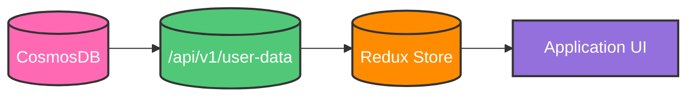
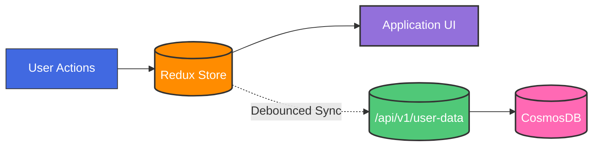

# Life Manager Design Document

## Table of Contents

1. [Core Architecture](#core-architecture)
   - [Technology Stack](#technology-stack)
   - [State Management](#state-management)
   - [Data Flow & Sync Strategy](#data-flow--sync-strategy)

2. [Data Models](#data-models)
   - [Frontend Data Models (TypeScript)](#frontend-data-models-typescript)
     - [Interface Usage Guidelines](#interface-usage-guidelines)
     - [Common Types](#common-types)
     - [Task Interface](#task-interface)
     - [Goal Interface](#goal-interface)
     - [Category Interface](#category-interface)
     - [Dashboard Interface](#dashboard-interface)
     - [Display Mappings](#display-mappings)
   - [Backend Data Models (CosmosDB)](#backend-data-models-cosmosdb)
     - [Container Strategy & Querying](#container-strategy--querying)
     - [Indexing Strategy](#indexing-strategy)
     - [Document Models](#document-models)

3. [APIs](#apis)
   - [Base URL](#base-url)
   - [Authentication](#authentication)
   - [Common Response Format](#common-response-format)
   - [Error Codes](#error-codes)
   - [Core Endpoints](#core-endpoints)
   - [Rate Limiting](#rate-limiting)


4. [Features & Implementation](#features--implementation)
   - [Home Page](#home-page)
     - [Core Components](#core-components)
     - [Available Widgets](#available-widgets)
     - [Widget Management](#widget-management)
   - [Weekly Plan Page](#weekly-plan-page)
     - [Core Components](#core-components-1)
     - [Interactions](#interactions)
     - [State Management](#state-management)
     - [Performance Optimizations](#performance-optimizations)
     - [Error Handling](#error-handling)
   - [Master List Page](#master-list-page)
     - [Page Layout](#page-layout)
     - [State Management](#state-management-1)
     - [Performance Optimizations](#performance-optimizations-1)
     - [Error Handling](#error-handling-1)


## Core Architecture

### Technology Stack
- Frontend: React, NextJS, TailwindCSS, Shadcn Components, Redux Toolkit
- Backend: Python, Flask
- Database: CosmosDB

### State Management

#### Global State (Redux)
All persistent data lives in Redux, serving as the single source of truth for the application. This includes:

1. **User Data**
   - Tasks
   - Goals
   - Categories
   - Dashboard configuration

2. **Application State**
   - Sync status
   - Last sync timestamp
   - Error states
   - User preferences

3. **Store Structure**
```typescript
interface RootState {
    tasks: {
        items: Record<UUID, Task>;
        loading: boolean;
        error: string | null;
    };
    goals: {
        items: Record<UUID, Goal>;
        loading: boolean;
        error: string | null;
    };
    categories: {
        items: Record<UUID, Category>;
        loading: boolean;
        error: string | null;
    };
    dashboard: {
        widgets: DashboardWidget[];
        loading: boolean;
        error: string | null;
    };
    sync: {
        status: 'idle' | 'syncing' | 'error';
        lastSynced: string | null;
        pendingChanges: number;
    };
}
```

#### Local State
Used only for temporary UI states within components:
- Form input values before submission
- Modal/dropdown open/closed states
- Component-specific loading states
- Any temporary data that doesn't need to persist

### Data Flow & Sync Strategy

#### User Login / Initial Load


#### User Interactions


#### 1. Initial Load
```typescript
// In _app.tsx or similar root component
const App = () => {
    const dispatch = useDispatch();

    useEffect(() => {
        const loadInitialData = async () => {
            try {
                dispatch(setLoading(true));
                const userData = await api.getUserData();
                dispatch(initializeStore(userData));
            } catch (error) {
                dispatch(setError(error.message));
            } finally {
                dispatch(setLoading(false));
            }
        };

        loadInitialData();
    }, []);

    return <AppContent />;
};
```

#### 2. State Updates
All state updates follow a consistent pattern using our `useStateSync` hook:

```typescript
type ChangeType = 'text' | 'status' | 'priority' | 'drag';

const SYNC_CONFIG: Record<ChangeType, { debounceMs: number }> = {
    text: { debounceMs: 1000 },      // Text input changes
    status: { debounceMs: 300 },     // Status toggles
    priority: { debounceMs: 500 },   // Priority adjustments
    drag: { debounceMs: 800 }        // Drag operations
};

export function useStateSync() {
    const dispatch = useDispatch();
    
    const handleChange = useCallback(<T extends { id: string }>(
        type: ChangeType,
        item: T,
        changes: Partial<T>
    ) => {
        // 1. Immediate Redux update
        dispatch({
            type: `${item.type}/update`,
            payload: { id: item.id, changes }
        });

        // 2. Debounced backend sync
        debouncedSync[type]({ id: item.id, ...changes });
    }, [dispatch]);

    return { handleChange };
}
```

#### 3. Component Integration
Components use the `useStateSync` hook for all data modifications:

```typescript
const TaskCard = ({ task }: { task: Task }) => {
    const { handleChange } = useStateSync();
    
    return (
        <div>
            <input
                value={task.title}
                onChange={e => handleChange('text', task, { 
                    title: e.target.value 
                })}
            />
            <StatusToggle
                status={task.status}
                onChange={status => handleChange('status', task, { 
                    status,
                    statusHistory: [
                        ...task.statusHistory,
                        { status, changedAt: new Date().toISOString() }
                    ]
                })}
            />
        </div>
    );
};
```

#### 4. Sync Status Management
A global sync indicator shows the current sync state:

```typescript
const SyncIndicator = () => {
    const syncState = useSelector((state: RootState) => state.sync);
    
    return (
        <div>
            {syncState.status === 'syncing' && (
                <Spinner size="sm" />
            )}
            {syncState.status === 'error' && (
                <ErrorIcon color="red" />
            )}
            {syncState.status === 'idle' && syncState.lastSynced && (
                <div className="text-sm text-gray-500">
                    Last saved: {formatTime(syncState.lastSynced)}
                </div>
            )}
        </div>
    );
};
```

#### 5. Error Handling
Failed sync operations are handled gracefully:

```typescript
const handleSyncError = async (error: Error, retryAttempt: number = 0) => {
    const MAX_RETRIES = 3;
    
    if (retryAttempt < MAX_RETRIES) {
        // Exponential backoff retry
        await new Promise(r => setTimeout(r, Math.pow(2, retryAttempt) * 1000));
        return performSync(retryAttempt + 1);
    }
    
    // After max retries, show error and provide manual retry option
    dispatch(setSyncError(error.message));
};
```

This architecture provides:
- Single source of truth in Redux
- Consistent state update pattern
- Optimistic updates with backend sync
- Clear sync status feedback
- Automatic error handling and retries
- Simple component integration

## Data Models

### Frontend Data Models (TypeScript)

#### Interface Usage Guidelines

1. **Strict Type Adherence**
   - All frontend components must strictly implement these interfaces
   - No extending interfaces without documentation and team review
   - No bypassing optional fields with type assertions (`!` or `as`)
   - All interface extensions must be backwards compatible

2. **State Management**
   - Redux store must maintain normalized data matching these interfaces
   - All API responses must be validated against these interfaces
   - No storing derived data that can be computed from interface fields
   - Use selectors for computing derived data

3. **Component Props**
   - Components should accept the smallest necessary subset of interfaces
   - Use TypeScript utility types to create precise prop interfaces:
     ```typescript
     // Good
     interface TaskTitleProps {
         task: Pick<Task, 'id' | 'title'>;
     }

     // Avoid
     interface TaskTitleProps {
         task: Task;  // Exposes unnecessary fields
     }
     ```
   - Document required vs optional props

4. **Modification Rules**
   - Interface changes require documentation update
   - Breaking changes must be versioned
   - Additions to interfaces must be optional fields
   - Update all relevant type definitions when modifying interfaces

#### Common Types
```typescript
type UUID = string;
type ISODateString = string;

type Status = 'notStarted' | 'workingOnIt' | 'complete';
type RecurrenceFrequency = 'daily' | 'weekly' | 'monthly' | 'yearly';
type TimeRange = 'day' | 'week' | 'month';
type WidgetType = 'todaysTasks' | 'progress' | 'upcomingTasks';

interface TimeTracking {
    estimatedMinutes?: number;
    actualMinutes?: number;
}

interface StatusHistoryEntry {
    status: Status;
    changedAt: ISODateString;
    notes?: string;
}

interface CompletionEntry {
    completedAt: ISODateString;
    completedBy: UUID;
    nextDueDate?: ISODateString;
    completionNotes?: string;
}

interface RecurrenceRule {
    frequency: RecurrenceFrequency;
    interval: number;
    endDate?: ISODateString;
    maxOccurrences?: number;
    daysOfWeek?: number[];  // 0-6 for weekly
    dayOfMonth?: number;    // 1-31 for monthly
    months?: number[];      // 1-12 for yearly
    weekOfMonth?: number;   // -1 to 5 (-1 for last)
}
```

#### Task Interface
```typescript
interface Task {
    id: UUID;
    userId: UUID;
    type: 'task';
    title: string;
    status: Status;
    priority: number;
    dynamicPriority: number;
    effort?: number;
    notes?: string;
    dueDate?: ISODateString;
    scheduledDate?: ISODateString;
    createdAt: ISODateString;
    updatedAt: ISODateString;
    categoryId?: UUID;
    subcategoryId?: UUID;
    
    statusHistory: StatusHistoryEntry[];
    completionHistory: CompletionEntry[];
    timeTracking?: TimeTracking;
    
    recurrence?: {
        isRecurring: boolean;
        rule?: RecurrenceRule;
    };
    
    tags?: string[];
    
    dependencies?: {
        blockedBy?: UUID[];
        blocks?: UUID[];
    };
    
    relationships?: {
        goalIds?: UUID[];
    };
}
```

#### Goal Interface
```typescript
interface Goal {
    id: UUID;
    userId: UUID;
    type: 'goal';
    title: string;
    status: Status;
    priority: number;
    dynamicPriority: number;
    effort?: number;
    notes?: string;
    categoryId?: UUID;
    subcategoryId?: UUID;
    createdAt: ISODateString;
    updatedAt: ISODateString;
    
    measurement?: {
        targetValue?: number;
        currentValue?: number;
        measureUnit?: string;
    };
    
    timeline: {
        startDate?: ISODateString;
        targetDate: ISODateString;
    };
    
    relationships?: {
        parentGoalId?: UUID;
        childGoalIds?: UUID[];
        taskIds?: UUID[];
    };
    
    progressHistory: {
        date: ISODateString;
        value: number;
        notes?: string;
    }[];
}
```

#### Category Interface
```typescript
interface Category {
    id: UUID;
    userId: UUID;
    name: string;
    color?: string;
    parentId?: UUID;
    
    organization: {
        icon?: string;
        displayOrder: number;
    };
    
    subcategories: {
        id: UUID;
        name: string;
        description?: string;
        color?: string;
        icon?: string;
        displayOrder: number;
    }[];
    
    description?: string;
    
    statistics?: {
        totalItems?: number;
        completedItems?: number;
        averageCompletionTime?: number;
    };
}
```

#### Dashboard Interface
```typescript
interface DashboardWidget {
    id: UUID;
    type: 'todaysTasks' | 'progress' | 'upcomingTasks';
    position: number;
    config: {
        title?: string;
        timeRange?: 'day' | 'week' | 'month';
    };
}

interface Dashboard {
    id: UUID;
    userId: UUID;
    widgets: DashboardWidget[];
}
```


### Display Mappings

#### Status Display Mapping
```typescript
const STATUS_DISPLAY = {
    notStarted: 'Not Started',
    workingOnIt: 'Working on It',
    complete: 'Complete'
};

const STATUS_COLORS = {
    notStarted: 'gray.500',
    workingOnIt: 'yellow.500',
    complete: 'green.500'
};
```

#### Priority Display Mapping
```typescript
const PRIORITY_DISPLAY = {
    ranges: [
        { min: 80, label: 'Very High', color: 'red.500' },
        { min: 60, label: 'High', color: 'orange.500' },
        { min: 40, label: 'Medium', color: 'yellow.500' },
        { min: 20, label: 'Low', color: 'green.500' },
        { min: 0, label: 'Very Low', color: 'green.250' }
    ]
};
```

#### Effort Display Mapping
```typescript
const EFFORT_DISPLAY = {
    1: 'Very Low',
    2: 'Low',
    3: 'Medium',
    4: 'High',
    5: 'Very High'
};
```

#### Time Range Display Mapping
```typescript
const TIME_RANGE_DISPLAY = {
    day: 'Daily',
    week: 'Weekly',
    month: 'Monthly'
};
```


### Backend Data Models (CosmosDB)


All variable names are in snake_case. All documents are stored in a single container to enable efficient querying of a user's complete data set.

#### Container Strategy & Querying
The application uses a single container strategy where:
- All document types (tasks, goals, categories, dashboard) live in one container
- Documents are partitioned by `user_id`
- The `type` field enables filtering within a user's partition
- Single query can efficiently retrieve all data for a user

Example query to get all user data:
```sql
SELECT * FROM c
WHERE c.user_id = @userId
```

#### Indexing Strategy
The container uses these indexes to optimize common query patterns:
```json
{
    "indexingPolicy": {
        "includedPaths": [
            {
                "path": "/user_id/?",
                "indexes": [
                    {
                        "kind": "Range",
                        "dataType": "String"
                    }
                ]
            },
            {
                "path": "/type/?",
                "indexes": [
                    {
                        "kind": "Range",
                        "dataType": "String"
                    }
                ]
            },
            {
                "path": "/updated_at/?",
                "indexes": [
                    {
                        "kind": "Range",
                        "dataType": "String"
                    }
                ]
            }
        ]
    }
}
```

#### Document Models

##### Task Document
```json
{
    // Metadata
    "id": "string (UUID)",
    "user_id": "string (UUID)",
    "type": "task",
    "partition_key": "string (user_id)",
    
    // Core Fields
    "title": "string",
    "status": "string (enum: not_started, working_on_it, complete)",
    "priority": "number (0-100)",
    "dynamic_priority": "number (0-100)",
    "effort": "number (1-5, optional)",
    "notes": "string (optional)",
    
    // Dates
    "due_date": "string (ISO date, optional)",
    "scheduled_date": "string (ISO date, optional)",
    "created_at": "string (ISO date)",
    "updated_at": "string (ISO date)",
    
    // Categories
    "category_id": "string (UUID, optional)",
    "subcategory_id": "string (UUID, optional)",
    
    // History Tracking
    "status_history": [
        {
            "status": "string (enum: not_started, working_on_it, complete)",
            "changed_at": "string (ISO date)",
            "notes": "string (optional)"
        }
    ],
    "completion_history": [
        {
            "completed_at": "string (ISO date)",
            "completed_by": "string (UUID)",
            "next_due_date": "string (ISO date, optional)",
            "completion_notes": "string (optional)"
        }
    ],
    
    // Time Management
    "time_tracking": {
        "estimated_minutes": "number (optional)",
        "actual_minutes": "number (optional)"
    },
    
    // Recurrence
    "recurrence": {
        "is_recurring": "boolean",
        "rule": {
            "frequency": "string (enum: daily, weekly, monthly, yearly)",
            "interval": "number",
            "end_date": "string (ISO date, optional)",
            "max_occurrences": "number (optional)",
            "days_of_week": "number[] (0-6, optional)",
            "day_of_month": "number (1-31, optional)",
            "months": "number[] (1-12, optional)",
            "week_of_month": "number (-1 to 5, optional)"
        }
    },
    
    // Relationships
    "tags": "string[] (optional)",
    "dependencies": {
        "blocked_by": "string[] (task UUIDs, optional)",
        "blocks": "string[] (task UUIDs, optional)"
    },
    "relationships": {
        "goal_ids": "string[] (goal UUIDs, optional)"
    }
}
```

##### Goal Document
```json
{
    // Metadata
    "id": "string (UUID)",
    "user_id": "string (UUID)",
    "type": "goal",
    "partition_key": "string (user_id)",
    
    // Core Fields
    "title": "string",
    "status": "string (enum: not_started, working_on_it, complete)",
    "priority": "number (0-100)",
    "dynamic_priority": "number (0-100)",
    "effort": "number (1-5, optional)",
    "notes": "string (optional)",
    
    // Categories
    "category_id": "string (UUID, optional)",
    "subcategory_id": "string (UUID, optional)",
    
    // Dates
    "created_at": "string (ISO date)",
    "updated_at": "string (ISO date)",
    
    // Measurement
    "measurement": {
        "target_value": "number (optional)",
        "current_value": "number (optional)",
        "measure_unit": "string (optional)"
    },
    
    // Timeline
    "timeline": {
        "start_date": "string (ISO date, optional)",
        "target_date": "string (ISO date)"
    },
    
    // Relationships
    "relationships": {
        "parent_goal_id": "string (UUID, optional)",
        "child_goal_ids": "string[] (goal UUIDs, optional)",
        "task_ids": "string[] (task UUIDs, optional)"
    },
    
    // Progress
    "progress_history": [
        {
            "date": "string (ISO date)",
            "value": "number",
            "notes": "string (optional)"
        }
    ]
}
```

##### Category Document
```json
{
    // Metadata
    "id": "string (UUID)",
    "user_id": "string (UUID)",
    "type": "category",
    "partition_key": "string (user_id)",
    
    // Core Fields
    "name": "string",
    "color": "string (optional)",
    "parent_id": "string (UUID, optional)",
    "description": "string (optional)",
    
    // Organization
    "organization": {
        "icon": "string (optional)",
        "display_order": "number"
    },
    
    // Subcategories
    "subcategories": [
        {
            "id": "string (UUID)",
            "name": "string",
            "description": "string (optional)",
            "color": "string (optional)",
            "icon": "string (optional)",
            "display_order": "number"
        }
    ],
    
    // Analytics
    "statistics": {
        "total_items": "number (optional)",
        "completed_items": "number (optional)",
        "average_completion_time": "number (optional)"
    }
}
```

##### Dashboard Document
```json
{
    // Metadata
    "id": "string (UUID)",
    "user_id": "string (UUID)",
    "type": "dashboard",
    "partition_key": "string (user_id)",
    
    // Widgets Configuration
    "widgets": [
        {
            "id": "string (UUID)",
            "type": "string (enum: todays_tasks, progress, upcoming_tasks)",
            "position": "number",
            "config": {
                "title": "string (optional)",
                "time_range": "string (enum: day, week, month, optional)"
            }
        }
    ]
}
```

## APIs

### Base URL
```
https://api.lifemanager.app/v1
```

### Authentication
All API endpoints require authentication using JWT tokens in the Authorization header:

```http
Authorization: Bearer <jwt_token>
```

JWT tokens are obtained through the authentication endpoint and contain:
- User ID
- Token expiration
- Token scope
- Issue timestamp

### Common Response Format
All API responses follow a consistent format:

```typescript
interface ApiResponse<T> {
    success: boolean;
    data?: T;
    error?: {
        code: string;
        message: string;
        details?: any;
    };
    metadata?: {
        timestamp: string;
        requestId: string;
        pagination?: {
            total: number;
            page: number;
            pageSize: number;
            hasMore: boolean;
        };
    };
}
```

### Error Codes
Standard HTTP status codes are used along with custom error codes:

| HTTP Status | Error Code | Description |
|------------|------------|-------------|
| 400 | INVALID_REQUEST | Malformed request or invalid parameters |
| 401 | UNAUTHORIZED | Missing or invalid authentication |
| 403 | FORBIDDEN | Valid auth but insufficient permissions |
| 404 | NOT_FOUND | Resource not found |
| 409 | CONFLICT | Resource conflict (e.g., duplicate) |
| 422 | VALIDATION_ERROR | Request validation failed |
| 429 | RATE_LIMITED | Too many requests |
| 500 | INTERNAL_ERROR | Server error |
| 503 | SERVICE_UNAVAILABLE | Service temporarily unavailable |

### Core Endpoints

#### Initial Data Load
```http
GET /api/v1/user-data
Description: Loads all user data at application startup. This is the only bulk data fetch operation.

Response: {
    success: true,
    data: {
        tasks: Record<UUID, Task>;
        goals: Record<UUID, Goal>;
        categories: Record<UUID, Category>;
        dashboard: Dashboard;
        lastSyncedAt: string; // ISO date
    }
}
```

#### Sync Changes
```http
POST /api/v1/sync
Description: Debounced endpoint that receives changes from the frontend. Called automatically after user actions with configured debounce times per change type.

Request Body: {
    changes: Array<{
        type: 'task' | 'goal' | 'category' | 'dashboard';
        operation: 'create' | 'update' | 'delete';
        id?: UUID;  // Required for update/delete
        data?: Partial<Task | Goal | Category | Dashboard>;  // Required for create/update
        timestamp: string;  // ISO date of when change occurred
        changeType?: 'text' | 'status' | 'priority' | 'drag';  // For debounce configuration
    }>;
    clientLastSync: string;  // ISO date of last successful sync
}

Response: {
    success: true,
    data: {
        // Only sent if server has newer changes
        serverChanges?: Array<{
            type: 'task' | 'goal' | 'category' | 'dashboard';
            operation: 'create' | 'update' | 'delete';
            id: UUID;
            data?: any;
            timestamp: string;
        }>;
        syncedAt: string;  // ISO date of this sync
    }
}
```

### Rate Limiting

Rate limits are configured per endpoint:

| Endpoint | Rate Limit |
|----------|------------|
| GET /user-data | 60 per hour |
| POST /sync | 120 per minute |

Rate limit headers are included in all responses:
```http
X-RateLimit-Limit: <limit>
X-RateLimit-Remaining: <remaining>
X-RateLimit-Reset: <reset_timestamp>
```

When rate limited, the API returns:
```json
{
    "success": false,
    "error": {
        "code": "RATE_LIMITED",
        "message": "Too many requests",
        "details": {
            "retryAfter": 60
        }
    }
}
```


## Features & Implementation