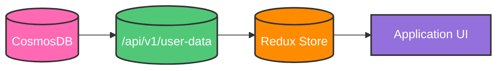
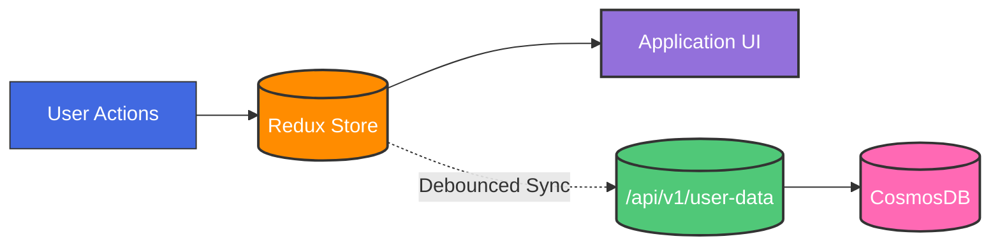

# Life Manager Design Document

## Table of Contents

1. [Core Architecture](#core-architecture)
   - [Technology Stack](#technology-stack)
   - [State Management](#state-management)
   - [Data Flow & Sync Strategy](#data-flow--sync-strategy)

2. [Data Models](#data-models)
   - [Frontend Data Models (TypeScript)](#frontend-data-models-typescript)
     - [Interface Usage Guidelines](#interface-usage-guidelines)
     - [Common Types](#common-types)
     - [Task Interface](#task-interface)
   - [Backend Data Models (CosmosDB)](#backend-data-models-cosmosdb)
     - [Container Strategy & Querying](#container-strategy--querying)
     - [Indexing Strategy](#indexing-strategy)
     - [Document Models](#document-models)

3. [APIs](#apis)
   - [Base URL](#base-url)
   - [Common Response Format](#common-response-format)
   - [Error Codes](#error-codes)
   - [Core Endpoints](#core-endpoints)

4. [Logging](#logging)
   - [Initial Load](#initial-load)
   - [State Changes](#state-changes)
   - [Backend Sync Operations](#backend-sync-operations)

5. [Implementation Details](#implementation-details)
   - [Project Structure](#project-structure)
   - [Page Implementations](#page-implementations)
     - [Master List Page](#master-list-page)
     - [Weekly Plan Page](#weekly-plan-page)
     - [Home Page](#home-page)
   - [Core Components](#core-components)
     - [Sidebar & Top Panel](#sidebar--top-panel)
   
6. [Styling & UI](#styling--ui)
    - [High-Level Strategy](#high-level-strategy)
    - [Layout Architecture](#layout-architecture)
    - [Design Tokens](#design-tokens)
    - [Interactive Elements](#interactive-elements)
    - [Component Architecture](#component-architecture)


## Core Architecture

### Technology Stack
- Frontend: React/Vite, TailwindCSS, Shadcn Components, Redux Toolkit
- Backend: Python, Flask
- Database: CosmosDB

### State Management

#### Global State (Redux)
All persistent data lives in Redux, serving as the single source of truth for the application. This includes:

1. **User Data**
   - Tasks

2. **Application State**
   - Sync status (success, error)
   - Last sync timestamp

3. **Store Structure**
```typescript
interface RootState {
    tasks: {
        items: Record<UUID, Task>;
        loading: boolean;
        error: string | null;
    };
    sync: {
        status: 'idle' | 'syncing' | 'error';
        lastSynced: string | null;
        pendingChanges: number;
    };
}
```

#### Local State
Used only for temporary UI states within components:
- Form input values before submission
- Modal/dropdown open/closed states
- Component-specific loading states
- Any temporary data that doesn't need to persist

### Data Flow & Sync Strategy

#### User Login / Initial Load



#### User Interactions



#### 1. Initial Load
```
// In the application's root component (e.g., _app.tsx)
// On initial load:
// 1. Dispatch a loading action to set the application state to loading.
// 2. Call the API to fetch initial user data.
// 3. On successful data fetch:
//    - Dispatch an action to initialize the Redux store with the fetched data.
// 4. On error:
//    - Dispatch an action to set the error state with the error message.
// 5. Finally:
//    - Dispatch a loading action to set the application state to not loading.
```

#### 2. State Updates
```
// The useStateSync hook provides a consistent way to handle state updates.
// It takes a change type (e.g., 'text', 'status', 'priority', 'drag') and an item with changes.
// 1. On change:
//    - Dispatch a Redux action to immediately update the store with the changes.
//      This dispatch triggers a Redux reducer that updates the state.
//    - Trigger a debounced backend sync operation based on the change type.
// The hook returns a handleChange function that components can use to update state.
// The SYNC_CONFIG object defines the debounce time for each change type.
```

#### 3. Component Integration
```
// All components use the same state management pattern to handle data modifications.
// For example, a TaskCard component:
// 1. Uses the handleChange function from useStateSync.
// 2. When the task title input changes:
//    - Calls handleChange with the 'text' change type, the task object, and the new title.
// 3. When the task status changes:
//    - Calls handleChange with the 'status' change type, the task object, and the new status and updated status history.
```

#### 4. Sync Status Management
```
// The SyncIndicator component provides visual feedback on the sync status.
// 1. It uses a Redux selector to get the current sync state.
// 2. If the sync status is 'syncing', it displays a spinner.
// 3. If the sync status is 'error', it displays an error icon.
//    The error icon will be displayed during retry attempts and after all retries have failed.
// 4. If the sync status is 'idle' and there is a last synced timestamp, it displays the last saved time.
```

#### 5. Error Handling
```
// The handleSyncError function handles failed sync operations.
// 1. It takes an error object and an optional retry attempt counter.
// 2. If the retry attempt is less than the maximum number of retries:
//    - It waits for an exponentially increasing amount of time.
//    - It calls the performSync function to retry the sync operation.
// 3. If the maximum number of retries is reached:
//    - It dispatches an action to set the sync error state with the error message.
```


This architecture provides:
- Single source of truth in Redux
- Consistent state update pattern
- Optimistic updates with backend sync
- Clear sync status feedback
- Automatic error handling and retries
- Simple component integration

## Data Models

### Frontend Data Models (TypeScript)

#### Interface Usage Guidelines

1. **Strict Type Adherence**
   - All frontend components must strictly implement these interfaces
   - No extending interfaces without documentation and team review
   - No bypassing optional fields with type assertions (`!` or `as`)
   - All interface extensions must be backwards compatible

2. **State Management**
   - Redux store must maintain normalized data matching these interfaces
   - All API responses must be validated against these interfaces
   - No storing derived data that can be computed from interface fields
   - Use selectors for computing derived data

3. **Component Props**
   - Components should accept the smallest necessary subset of interfaces
   - Use TypeScript utility types to create precise prop interfaces:
     ```typescript
     // Good
     interface TaskTitleProps {
         task: Pick<Task, 'id' | 'title'>;
     }

     // Avoid
     interface TaskTitleProps {
         task: Task;  // Exposes unnecessary fields
     }
     ```
   - Document required vs optional props

4. **Modification Rules**
   - Interface changes require documentation update
   - Breaking changes must be versioned
   - Additions to interfaces must be optional fields
   - Update all relevant type definitions when modifying interfaces

#### Common Types
```typescript
type UUID = string;
type ISODateString = string;

type Status = 'notStarted' | 'workingOnIt' | 'complete';
type RecurrenceFrequency = 'daily' | 'weekly' | 'monthly' | 'yearly';
type TimeRange = 'day' | 'week' | 'month';

interface CompletionEntry {
    completedAt: ISODateString;
    nextDueDate?: ISODateString;
    completionNotes?: string;
}

interface RecurrenceRule {
    frequency: RecurrenceFrequency;
    interval: number;
    endDate?: ISODateString;
    maxOccurrences?: number;
    daysOfWeek?: number[];  // 0-6 for weekly
    dayOfMonth?: number;    // 1-31 for monthly
    months?: number[];      // 1-12 for yearly
    weekOfMonth?: number;   // -1 to 5 (-1 for last)
}
```

#### Task Interface
```typescript
interface Task {
    id: UUID;
    userId: UUID;
    type: 'task';
    title: string;
    status: Status;
    priority: number;
    dynamicPriority: number;
    effort?: number;
    notes?: string;
    dueDate?: ISODateString;
    scheduledDate?: ISODateString;
    createdAt: ISODateString;
    updatedAt: ISODateString;
    
    completionHistory: CompletionEntry[];
    
    recurrence?: {
        isRecurring: boolean;
        rule?: RecurrenceRule;
    };
    
    tags?: string[];
}
```

### Display Mappings

#### Status Display Mapping
```typescript
const STATUS_DISPLAY = {
    notStarted: 'Not Started',
    workingOnIt: 'Working on It',
    complete: 'Complete'
};

const STATUS_COLORS = {
    notStarted: 'gray.500',
    workingOnIt: 'yellow.500',
    complete: 'green.500'
};
```

#### Priority Display Mapping
```typescript
const PRIORITY_DISPLAY = {
    ranges: [
        { min: 80, label: 'Very High', color: 'red.500' },
        { min: 60, label: 'High', color: 'orange.500' },
        { min: 40, label: 'Medium', color: 'yellow.500' },
        { min: 20, label: 'Low', color: 'green.500' },
        { min: 0, label: 'Very Low', color: 'green.250' }
    ]
};
```

#### Effort Display Mapping
```typescript
const EFFORT_DISPLAY = {
    1: {
        label: 'Very Low',
        color: 'green.300'  // Light green for minimal effort
    },
    2: {
        label: 'Low',
        color: 'green.500'  // Medium green for low effort
    },
    3: {
        label: 'Medium',
        color: 'yellow.500'  // Yellow for moderate effort
    },
    4: {
        label: 'High',
        color: 'orange.500'  // Orange for high effort
    },
    5: {
        label: 'Very High',
        color: 'red.500'  // Red for maximum effort
    }
};
```

#### Time Range Display Mapping
```typescript
const TIME_RANGE_DISPLAY = {
    day: 'Daily',
    week: 'Weekly',
    month: 'Monthly'
};
```

### Backend Data Models (CosmosDB)

All variable names are in snake_case. All documents are stored in a single container to enable efficient querying of a user's complete data set.
The frontend uses camelCase for its data models. A manual conversion process is used to handle the differences in naming conventions during API requests and responses.

#### Case Conversion Functions

All data transformations between the backend's `snake_case` data models and the frontend's `camelCase` data models are handled on the backend. This ensures that the frontend receives data in the expected format without needing to perform any conversion logic.

The backend uses two types of case conversion:

1. **Key Case Conversion**: All object keys are converted between snake_case and camelCase.
   ```python
   # Example key conversion:
   "user_id" <-> "userId"
   "created_at" <-> "createdAt"
   "due_date" <-> "dueDate"
   ```

2. **Value Case Conversion**: Certain enumerated string values are also converted between cases.
   ```python
   # Fields that need value case conversion:
   CASE_CONVERTIBLE_FIELDS = ["status"]  # Add more fields as needed

   # Example value conversion for status:
   "not_started" <-> "notStarted"
   "working_on_it" <-> "workingOnIt"
   ```

The conversion process:
1. For frontend responses (snake_to_camel):
   - First converts enumerated values to camelCase
   - Then converts all keys to camelCase

2. For backend storage (camel_to_snake):
   - First converts all keys to snake_case
   - Then converts enumerated values to snake_case

This approach:
- Centralizes the transformation logic
- Makes it easy to add new fields that need value conversion
- Ensures consistency across all API responses
- Simplifies frontend code by removing the need for any data conversion logic
- Makes debugging easier with explicit string manipulation

#### Container Strategy & Querying
The application uses a single container strategy where:
- All task documents live in one container
- Documents are partitioned by `user_id`
- The `type` field enables filtering within a user's partition
- Single query can efficiently retrieve all data for a user

Example query to get all user data:
```sql
SELECT * FROM c
WHERE c.user_id = @userId
```

#### Indexing Strategy
The container uses these indexes to optimize common query patterns:
```json
{
    "indexingPolicy": {
        "includedPaths": [
            {
                "path": "/user_id/?",
                "indexes": [
                    {
                        "kind": "Range",
                        "dataType": "String"
                    }
                ]
            },
            {
                "path": "/type/?",
                "indexes": [
                    {
                        "kind": "Range",
                        "dataType": "String"
                    }
                ]
            },
            {
                "path": "/updated_at/?",
                "indexes": [
                    {
                        "kind": "Range",
                        "dataType": "String"
                    }
                ]
            }
        ]
    }
}
```

#### Document Models

##### Task Document
```json
{
    // Metadata
    "id": "string (UUID)",
    "user_id": "string (UUID)",
    "type": "task",
    "partition_key": "string (user_id)",
    
    // Core Fields
    "title": "string",
    "status": "string (enum: not_started, working_on_it, complete)",
    "priority": "number (0-100)",
    "dynamic_priority": "number (0-100)",
    "effort": "number (1-5, optional)",
    "notes": "string (optional)",
    
    // Dates
    "due_date": "string (ISO date, optional)",
    "scheduled_date": "string (ISO date, optional)",
    "created_at": "string (ISO date)",
    "updated_at": "string (ISO date)",
    
    "completion_history": [
        {
            "completed_at": "string (ISO date)",
            "next_due_date": "string (ISO date, optional)",
            "completion_notes": "string (optional)"
        }
    ],
    

    // Recurrence
    "recurrence": {
        "is_recurring": "boolean",
        "rule": {
            "frequency": "string (enum: daily, weekly, monthly, yearly)",
            "interval": "number",
            "days_of_week": "number[] (0-6, optional)",
            "day_of_month": "number (1-31, optional)",
            "months": "number[] (1-12, optional)",
            "week_of_month": "number (-1 to 5, optional)"
        }
    }

}
```

## APIs

### Base URL
```
https://api.lifemanager.app/v1
```

### Common Response Format
All API responses follow a consistent format:

```typescript
interface ApiResponse<T> {
    success: boolean;
    data?: T;
    error?: {
        code: string;
        message: string;
        details?: any;
    };
    metadata?: {
        timestamp: string;
        requestId: string;
        pagination?: {
            total: number;
            page: number;
            pageSize: number;
            hasMore: boolean;
        };
    };
}
```

### Error Codes
Standard HTTP status codes are used along with custom error codes.
The API response will include the HTTP status code and the custom error code in the error object.

| HTTP Status | Error Code | Description |
|------------|------------|-------------|
| 400 | INVALID_REQUEST | Malformed request or invalid parameters |
| 404 | NOT_FOUND | Resource not found |
| 409 | CONFLICT | Resource conflict (e.g., duplicate) |
| 422 | VALIDATION_ERROR | Request validation failed |
| 500 | INTERNAL_ERROR | Server error |
| 503 | SERVICE_UNAVAILABLE | Service temporarily unavailable |

### Core Endpoints

#### Initial Data Load
```http
GET /api/v1/user-data
Description: Loads all user data at application startup. This is the only bulk data fetch operation.

Response: {
    success: true,
    data: {
        tasks: Record<UUID, Task>;
        lastSyncedAt: string; // ISO date
    }
}
```

#### Sync Changes
```http
POST /api/v1/sync
Description: Debounced endpoint that receives changes from the frontend. Called automatically after user actions with configured debounce times per change type.

Request Body: {
    changes: Array<{
        type: 'task';
        operation: 'create' | 'update' | 'delete';
        id?: UUID;  // Required for update/delete
        data?: Partial<Task>;  // Required for create/update
        timestamp: string;  // ISO date of when change occurred
        changeType?: 'text' | 'status' | 'priority' | 'drag';  // For debounce configuration
    }>;
    clientLastSync: string;  // ISO date of last successful sync
}

Response: {
    success: true,
    data: {
        // Only sent if server has newer changes
        serverChanges?: Array<{
            type: 'task';
            operation: 'create' | 'update' | 'delete';
            id: UUID;
            data?: any;
            timestamp: string;
        }>;
        syncedAt: string;  // ISO date of this sync
    }
}
```

###  Logging

#### Initial Load
On application load, the entire Redux state is logged to the console:
```typescript
// In store configuration
const store = configureStore({
  reducer: rootReducer,
  middleware: (getDefaultMiddleware) =>
    getDefaultMiddleware().concat(logger),
});

// Custom logger middleware
const logger = store => next => action => {
  if (action.type === '@@INIT') {
    console.log('Initial Redux State:', store.getState());
  }
  return next(action);
};
```

#### State Changes
Every Redux state change is logged to the console with:
- The action type
- The specific state changes (diff)
- Timestamp of the change

```typescript
// Example console output for a task update
{
  type: 'tasks/updateTask',
  payload: {
    id: '123',
    changes: {
      title: 'Updated Task Title',
      status: 'workingOnIt'
    }
  },
  timestamp: '2024-01-20T12:34:56.789Z'
}
```

#### Backend Sync Operations
Each sync operation is logged with:
- The changes being synced
- The sync result (success/failure)
- Any error messages if applicable

```typescript
// Example console output for sync operation
{
  type: 'sync/started',
  changes: [
    {
      type: 'task',
      operation: 'update',
      id: '123',
      data: { title: 'Updated Task Title' }
    }
  ],
  timestamp: '2024-01-20T12:34:57.789Z'
}

// Success case
{
  type: 'sync/completed',
  result: 'success',
  syncedAt: '2024-01-20T12:34:58.789Z'
}

// Failure case
{
  type: 'sync/failed',
  error: {
    code: 'NETWORK_ERROR',
    message: 'Failed to connect to server'
  },
  timestamp: '2024-01-20T12:34:58.789Z'
}
```


## Implementation Details

### Project Structure
The project follows a well-organized structure detailed in [project_structure.md](./project_structure.md). Key highlights include:

- Clear separation of frontend and backend code
- Organized component hierarchy
- Consistent file naming and organization
- Centralized configuration files
- Documentation organization

### Page Implementations

#### Master List Page
The Master List page implementation is documented in [master_list.md](./master_list.md). It covers:

- Table-based task display
- Task creation and modification
- Status updates and animations
- Priority and effort management
- Task details dialog
- Sync operations

#### Weekly Plan Page
*Detailed design document pending*

The Weekly Plan page will follow similar documentation patterns as the Master List page, with its own specific requirements and implementation details.

#### Home Page
*Detailed design document pending*

The Home page will follow similar documentation patterns as the Master List page, with its own specific requirements and implementation details.

### Core Components

#### Sidebar & Top Panel

##### Overview
The application includes a persistent global sidebar (on the left) and a top panel (header bar) that remain visible across all pages. These two navigation and control areas ensure quick access to core features and important indicators (sync status, settings, login/logout, etc.).

##### Goals & Requirements

###### Centralized Navigation
- Provide quick links to core pages (Home, Weekly Plan, Master List, etc.)
- Allow easy navigation without refreshing or reloading the application

###### Persistent Visibility
- Remain visible/accessible at all times, regardless of the active page
- Collapse or expand the sidebar in response to user preference or screen size

###### Key Controls in Top Panel
- Settings button for user preferences, theme toggles, or account info
- Sync/Save Indicator to reflect the real-time sync status from the Redux store
- Login/Logout button/indicator to manage authentication state

###### Responsive & Accessible
- Adapt layout for mobile, tablet, and desktop screen sizes
- Provide clear focus states, ARIA labels, and keyboard navigation

##### Layout & Components
```
+------------------------------------------------------------------------+
| [App Logo / Title]            [Sync Indicator]  [Settings]  [Logout]   |
+------------------+-----------------------------------------------------+
|   Sidebar        |  Main Content Area                       |
|   [Nav Links]    |  (Home / Weekly Plan / Master List etc.) |
|   [User Info]    |                                          |
|   [Collapse Btn] |                                          |
+------------------+-----------------------------------------------------+
```

##### Sidebar Implementation

###### Navigation Links
- Home
- Weekly Plan
- Master List

###### User Info / Profile Section 
- Empty for now

###### Collapse/Expand Control
- A button (e.g., a hamburger icon or double-chevron) that toggles the sidebar's width
- Uses local React state since it only affects the layout

###### Responsive Behavior
- Mobile: The sidebar may slide in/out over the content
- Desktop: The sidebar remains docked on the left

###### Implementation Details
- Housed in a `<Sidebar>` component, rendered at the same level as the main content
- All navigation items are stored in an array or config object (e.g., `NAV_LINKS = [{ path: '/home', label: 'Home', icon: ... }, ...]`), then mapped to `<NavLink>` items
- Uses local React state for collapse state since it only affects the layout

##### Top Panel Implementation

###### Position & Layout
- Stays at the top of the viewport, spanning the full width

###### Content Components
- App Logo or Title: Left-aligned; navigates back to Home or a landing page
- Sync/Save Indicator:
  - Reflects the Redux sync state (idle, syncing, error)
  - Could be a small icon + text (e.g., "All changes saved" or a spinner if syncing)
  - Ties into the same sync slice that other pages use (see Core Architecture > State Management)
  - Top right corner
- Settings Button:
  - Opens a modal or dedicated page with user-configurable settings (theme, notifications, account details, etc.)
  - Could be an icon button that triggers `<SettingsModal>`
  - Inactive for now
  - Top right corner
- Login/Logout Button:
  - Shows "Login" if user is not authenticated, "Logout" if user is authenticated
  - On click, dispatches an auth action or navigates to a login page
  - Top right corner
  - Inactive for now


## Styling & UI

### Core Principles
- Use Tailwind CSS as the primary styling solution
- Configure core design tokens (colors, typography, spacing) in `tailwind.config.js`
- Leverage shadcn/ui components for common UI elements
- Minimize component-specific styling
- Maintain consistent responsive behavior across all pages
- lucide icons

### Global Configuration

#### Tailwind Setup
```javascript
// tailwind.config.js
module.exports = {
  theme: {
    extend: {
      colors: {
        // Core brand colors
        primary: '#1D4ED8',
        secondary: '#9333EA',
        accent: '#F59E0B'
      },
      fontFamily: {
        sans: ['Inter', 'sans-serif']
      }
    }
  }
}
```

#### Component Library
- Use shadcn/ui components for standard UI elements (buttons, inputs, modals)
- Maintain default shadcn styling unless specific requirements dictate otherwise
- Configure component themes through shadcn's built-in theming system

### Layout Structure
- Global layout wrapper handles standard page structure
- Responsive design uses Tailwind's breakpoint system
- Consistent spacing and container widths across pages

### Styling Guidelines
1. Use Tailwind utility classes for layout and basic styling
2. Apply component-specific styles only when required by design specs
3. Keep custom CSS minimal and well-documented
4. Maintain consistent spacing, typography, and color usage across components

### Visual Feedback
- Status indicators follow predefined color schemes
- Loading states use consistent animations
- Error states maintain uniform styling
- Toast notifications follow a standard design pattern