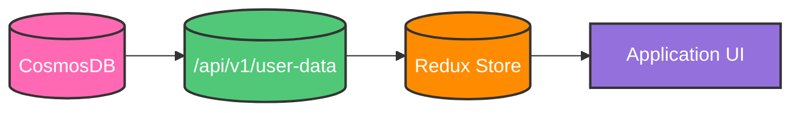
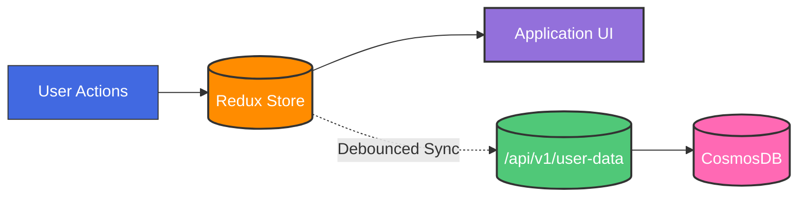

# Life Manager Design Document

## Table of Contents

1. [Core Architecture](#core-architecture)
   - [Technology Stack](#technology-stack)
   - [State Management](#state-management)
   - [Data Flow & Sync Strategy](#data-flow--sync-strategy)

2. [Data Models](#data-models)
   - [Frontend Data Models (TypeScript)](#frontend-data-models-typescript)
     - [Interface Usage Guidelines](#interface-usage-guidelines)
     - [Common Types](#common-types)
     - [Task Interface](#task-interface)
     - [Goal Interface](#goal-interface)
     - [Category Interface](#category-interface)
     - [Dashboard Interface](#dashboard-interface)
     - [Display Mappings](#display-mappings)
   - [Backend Data Models (CosmosDB)](#backend-data-models-cosmosdb)
     - [Container Strategy & Querying](#container-strategy--querying)
     - [Indexing Strategy](#indexing-strategy)
     - [Document Models](#document-models)

3. [APIs](#apis)
   - [Base URL](#base-url)
   - [Authentication](#authentication)
   - [Common Response Format](#common-response-format)
   - [Error Codes](#error-codes)
   - [Core Endpoints](#core-endpoints)
   - [Rate Limiting](#rate-limiting)


4. [Features & Implementation](#features--implementation)
   - [Sidebar & Top Panel](#sidebar--top-panel)
   - [Home Page](#home-page)
   - [Weekly Plan Page](#weekly-plan-page)
   - [Master List Page](#master-list-page)
   
5. [Styling & UI](#styling--ui)
    - [High-Level Strategy](#high-level-strategy)
    - [Layout Architecture](#layout-architecture)
    - [Design Tokens](#design-tokens)
    - [Interactive Elements](#interactive-elements)
    - [Component Architecture](#component-architecture)


## Core Architecture

### Technology Stack
- Frontend: React/Vite, TailwindCSS, Shadcn Components, Redux Toolkit
- Backend: Python, Flask
- Database: CosmosDB

### State Management

#### Global State (Redux)
All persistent data lives in Redux, serving as the single source of truth for the application. This includes:

1. **User Data**
   - Tasks
   - Goals
   - Categories
   - Dashboard configuration

2. **Application State**
   - Sync status
   - Last sync timestamp
   - Error states
   - User preferences

3. **Store Structure**
```typescript
interface RootState {
    tasks: {
        items: Record<UUID, Task>;
        loading: boolean;
        error: string | null;
    };
    goals: {
        items: Record<UUID, Goal>;
        loading: boolean;
        error: string | null;
    };
    categories: {
        items: Record<UUID, Category>;
        loading: boolean;
        error: string | null;
    };
    dashboard: {
        widgets: DashboardWidget[];
        loading: boolean;
        error: string | null;
    };
    sync: {
        status: 'idle' | 'syncing' | 'error';
        lastSynced: string | null;
        pendingChanges: number;
    };
}
```

#### Local State
Used only for temporary UI states within components:
- Form input values before submission
- Modal/dropdown open/closed states
- Component-specific loading states
- Any temporary data that doesn't need to persist

### Data Flow & Sync Strategy

#### User Login / Initial Load


#### User Interactions


#### 1. Initial Load
```
// In the application's root component (e.g., _app.tsx)
// On initial load:
// 1. Dispatch a loading action to set the application state to loading.
// 2. Call the API to fetch initial user data.
// 3. On successful data fetch:
//    - Dispatch an action to initialize the Redux store with the fetched data.
// 4. On error:
//    - Dispatch an action to set the error state with the error message.
// 5. Finally:
//    - Dispatch a loading action to set the application state to not loading.
```

#### 2. State Updates
```
// The useStateSync hook provides a consistent way to handle state updates.
// It takes a change type (e.g., 'text', 'status', 'priority', 'drag') and an item with changes.
// 1. On change:
//    - Dispatch a Redux action to immediately update the store with the changes.
//      This dispatch triggers a Redux reducer that updates the state.
//    - Trigger a debounced backend sync operation based on the change type.
// The hook returns a handleChange function that components can use to update state.
// The SYNC_CONFIG object defines the debounce time for each change type.
```

#### 3. Component Integration
```
// Components use the useStateSync hook to handle data modifications.
// For example, a TaskCard component:
// 1. Uses the handleChange function from useStateSync.
// 2. When the task title input changes:
//    - Calls handleChange with the 'text' change type, the task object, and the new title.
// 3. When the task status changes:
//    - Calls handleChange with the 'status' change type, the task object, and the new status and updated status history.
```

#### 4. Sync Status Management
```
// The SyncIndicator component provides visual feedback on the sync status.
// 1. It uses a Redux selector to get the current sync state.
// 2. If the sync status is 'syncing', it displays a spinner.
// 3. If the sync status is 'error', it displays an error icon.
//    The error icon will be displayed during retry attempts and after all retries have failed.
// 4. If the sync status is 'idle' and there is a last synced timestamp, it displays the last saved time.
```

#### 5. Error Handling
```
// The handleSyncError function handles failed sync operations.
// 1. It takes an error object and an optional retry attempt counter.
// 2. If the retry attempt is less than the maximum number of retries:
//    - It waits for an exponentially increasing amount of time.
//    - It calls the performSync function to retry the sync operation.
// 3. If the maximum number of retries is reached:
//    - It dispatches an action to set the sync error state with the error message.
```

This architecture provides:
- Single source of truth in Redux
- Consistent state update pattern
- Optimistic updates with backend sync
- Clear sync status feedback
- Automatic error handling and retries
- Simple component integration

## Data Models

### Frontend Data Models (TypeScript)

#### Interface Usage Guidelines

1. **Strict Type Adherence**
   - All frontend components must strictly implement these interfaces
   - No extending interfaces without documentation and team review
   - No bypassing optional fields with type assertions (`!` or `as`)
   - All interface extensions must be backwards compatible

2. **State Management**
   - Redux store must maintain normalized data matching these interfaces
   - All API responses must be validated against these interfaces
   - No storing derived data that can be computed from interface fields
   - Use selectors for computing derived data

3. **Component Props**
   - Components should accept the smallest necessary subset of interfaces
   - Use TypeScript utility types to create precise prop interfaces:
     ```typescript
     // Good
     interface TaskTitleProps {
         task: Pick<Task, 'id' | 'title'>;
     }

     // Avoid
     interface TaskTitleProps {
         task: Task;  // Exposes unnecessary fields
     }
     ```
   - Document required vs optional props

4. **Modification Rules**
   - Interface changes require documentation update
   - Breaking changes must be versioned
   - Additions to interfaces must be optional fields
   - Update all relevant type definitions when modifying interfaces

#### Common Types
```typescript
type UUID = string;
type ISODateString = string;

type Status = 'notStarted' | 'workingOnIt' | 'complete';
type RecurrenceFrequency = 'daily' | 'weekly' | 'monthly' | 'yearly';
type TimeRange = 'day' | 'week' | 'month';
type WidgetType = 'todaysTasks' | 'progress' | 'upcomingTasks';

interface TimeTracking {
    estimatedMinutes?: number;
    actualMinutes?: number;
}

interface StatusHistoryEntry {
    status: Status;
    changedAt: ISODateString;
    notes?: string;
}

interface CompletionEntry {
    completedAt: ISODateString;
    completedBy: UUID;
    nextDueDate?: ISODateString;
    completionNotes?: string;
}

interface RecurrenceRule {
    frequency: RecurrenceFrequency;
    interval: number;
    endDate?: ISODateString;
    maxOccurrences?: number;
    daysOfWeek?: number[];  // 0-6 for weekly
    dayOfMonth?: number;    // 1-31 for monthly
    months?: number[];      // 1-12 for yearly
    weekOfMonth?: number;   // -1 to 5 (-1 for last)
}
```

#### Task Interface
```typescript
interface Task {
    id: UUID;
    userId: UUID;
    type: 'task';
    title: string;
    status: Status;
    priority: number;
    dynamicPriority: number;
    effort?: number;
    notes?: string;
    dueDate?: ISODateString;
    scheduledDate?: ISODateString;
    createdAt: ISODateString;
    updatedAt: ISODateString;
    categoryId?: UUID;
    subcategoryId?: UUID;
    
    statusHistory: StatusHistoryEntry[];
    completionHistory: CompletionEntry[];
    timeTracking?: TimeTracking;
    
    recurrence?: {
        isRecurring: boolean;
        rule?: RecurrenceRule;
    };
    
    tags?: string[];
    
    dependencies?: {
        blockedBy?: UUID[];
        blocks?: UUID[];
    };
    
    relationships?: {
        goalIds?: UUID[];
    };
}
```

#### Goal Interface
```typescript
interface Goal {
    id: UUID;
    userId: UUID;
    type: 'goal';
    title: string;
    status: Status;
    priority: number;
    dynamicPriority: number;
    effort?: number;
    notes?: string;
    categoryId?: UUID;
    subcategoryId?: UUID;
    createdAt: ISODateString;
    updatedAt: ISODateString;
    
    measurement?: {
        targetValue?: number;
        currentValue?: number;
        measureUnit?: string;
    };
    
    timeline: {
        startDate?: ISODateString;
        targetDate: ISODateString;
    };
    
    relationships?: {
        parentGoalId?: UUID;
        childGoalIds?: UUID[];
        taskIds?: UUID[];
    };
    
    progressHistory: {
        date: ISODateString;
        value: number;
        notes?: string;
    }[];
}
```

#### Category Interface
```typescript
interface Category {
    id: UUID;
    userId: UUID;
    name: string;
    color?: string;
    parentId?: UUID;
    
    organization: {
        icon?: string;
        displayOrder: number;
    };
    
    subcategories: {
        id: UUID;
        name: string;
        description?: string;
        color?: string;
        icon?: string;
        displayOrder: number;
    }[];
    
    description?: string;
    
    statistics?: {
        totalItems?: number;
        completedItems?: number;
        averageCompletionTime?: number;
    };
}
```

#### Dashboard Interface
```typescript
interface DashboardWidget {
    id: UUID;
    type: 'todaysTasks' | 'progress' | 'upcomingTasks';
    position: number;
    config: {
        title?: string;
        timeRange?: 'day' | 'week' | 'month';
    };
}

interface Dashboard {
    id: UUID;
    userId: UUID;
    widgets: DashboardWidget[]; // This array of DashboardWidget objects maps directly to the widget objects in the Dashboard document.
}
```


### Display Mappings

#### Status Display Mapping
```typescript
const STATUS_DISPLAY = {
    notStarted: 'Not Started',
    workingOnIt: 'Working on It',
    complete: 'Complete'
};

const STATUS_COLORS = {
    notStarted: 'gray.500',
    workingOnIt: 'yellow.500',
    complete: 'green.500'
};
```

#### Priority Display Mapping
```typescript
const PRIORITY_DISPLAY = {
    ranges: [
        { min: 80, label: 'Very High', color: 'red.500' },
        { min: 60, label: 'High', color: 'orange.500' },
        { min: 40, label: 'Medium', color: 'yellow.500' },
        { min: 20, label: 'Low', color: 'green.500' },
        { min: 0, label: 'Very Low', color: 'green.250' }
    ]
};
```

#### Effort Display Mapping
```typescript
const EFFORT_DISPLAY = {
    1: 'Very Low',
    2: 'Low',
    3: 'Medium',
    4: 'High',
    5: 'Very High'
};
```

#### Time Range Display Mapping
```typescript
const TIME_RANGE_DISPLAY = {
    day: 'Daily',
    week: 'Weekly',
    month: 'Monthly'
};
```


### Backend Data Models (CosmosDB)


All variable names are in snake_case. All documents are stored in a single container to enable efficient querying of a user's complete data set.
The frontend uses camelCase for its data models. A library or manual conversion process will be used to handle the differences in naming conventions during API requests and responses.

#### Case Conversion Function

All data transformations between the backend's `snake_case` data models and the frontend's `camelCase` data models are handled on the backend. This ensures that the frontend receives data in the expected format without needing to perform any conversion logic.

The backend uses a dedicated transformation function or library to convert data structures between the two naming conventions. This process occurs before sending data in API responses.

For example, a `task` document from CosmosDB with fields like `user_id`, `created_at`, and `due_date` will be transformed into a JSON object with fields like `userId`, `createdAt`, and `dueDate` before being sent to the frontend.

This approach centralizes the transformation logic, making it easier to maintain and ensuring consistency across all API responses. It also simplifies the frontend code by removing the need for any data conversion logic.

#### Container Strategy & Querying
The application uses a single container strategy where:
- All document types (tasks, goals, categories, dashboard) live in one container
- Documents are partitioned by `user_id`
- The `type` field enables filtering within a user's partition
- Single query can efficiently retrieve all data for a user

Example query to get all user data:
```sql
SELECT * FROM c
WHERE c.user_id = @userId
```

#### Indexing Strategy
The container uses these indexes to optimize common query patterns:
```json
{
    "indexingPolicy": {
        "includedPaths": [
            {
                "path": "/user_id/?",
                "indexes": [
                    {
                        "kind": "Range",
                        "dataType": "String"
                    }
                ]
            },
            {
                "path": "/type/?",
                "indexes": [
                    {
                        "kind": "Range",
                        "dataType": "String"
                    }
                ]
            },
            {
                "path": "/updated_at/?",
                "indexes": [
                    {
                        "kind": "Range",
                        "dataType": "String"
                    }
                ]
            }
        ]
    }
}
```

#### Document Models

##### Task Document
```json
{
    // Metadata
    "id": "string (UUID)",
    "user_id": "string (UUID)",
    "type": "task",
    "partition_key": "string (user_id)",
    
    // Core Fields
    "title": "string",
    "status": "string (enum: not_started, working_on_it, complete)",
    "priority": "number (0-100)",
    "dynamic_priority": "number (0-100)",
    "effort": "number (1-5, optional)",
    "notes": "string (optional)",
    
    // Dates
    "due_date": "string (ISO date, optional)",
    "scheduled_date": "string (ISO date, optional)",
    "created_at": "string (ISO date)",
    "updated_at": "string (ISO date)",
    
    // Categories
    "category_id": "string (UUID, optional)",
    "subcategory_id": "string (UUID, optional)",
    
    // History Tracking
    "status_history": [
        {
            "status": "string (enum: not_started, working_on_it, complete)",
            "changed_at": "string (ISO date)",
            "notes": "string (optional)"
        }
    ],
    "completion_history": [
        {
            "completed_at": "string (ISO date)",
            "completed_by": "string (UUID)",
            "next_due_date": "string (ISO date, optional)",
            "completion_notes": "string (optional)"
        }
    ],
    
    // Time Management
    "time_tracking": {
        "estimated_minutes": "number (optional)",
        "actual_minutes": "number (optional)"
    },
    
    // Recurrence
    "recurrence": {
        "is_recurring": "boolean",
        "rule": {
            "frequency": "string (enum: daily, weekly, monthly, yearly)",
            "interval": "number",
            "end_date": "string (ISO date, optional)",
            "max_occurrences": "number (optional)",
            "days_of_week": "number[] (0-6, optional)",
            "day_of_month": "number (1-31, optional)",
            "months": "number[] (1-12, optional)",
            "week_of_month": "number (-1 to 5, optional)"
        }
    },
    
    // Relationships
    "tags": "string[] (optional)",
    "dependencies": {
        "blocked_by": "string[] (task UUIDs, optional)",
        "blocks": "string[] (task UUIDs, optional)"
    },
    "relationships": {
        "goal_ids": "string[] (goal UUIDs, optional)"
    }
}
```

##### Goal Document
```json
{
    // Metadata
    "id": "string (UUID)",
    "user_id": "string (UUID)",
    "type": "goal",
    "partition_key": "string (user_id)",
    
    // Core Fields
    "title": "string",
    "status": "string (enum: not_started, working_on_it, complete)",
    "priority": "number (0-100)",
    "dynamic_priority": "number (0-100)",
    "effort": "number (1-5, optional)",
    "notes": "string (optional)",
    
    // Categories
    "category_id": "string (UUID, optional)",
    "subcategory_id": "string (UUID, optional)",
    
    // Dates
    "created_at": "string (ISO date)",
    "updated_at": "string (ISO date)",
    
    // Measurement
    "measurement": {
        "target_value": "number (optional)",
        "current_value": "number (optional)",
        "measure_unit": "string (optional)"
    },
    
    // Timeline
    "timeline": {
        "start_date": "string (ISO date, optional)",
        "target_date": "string (ISO date)"
    },
    
    // Relationships
    "relationships": {
        "parent_goal_id": "string (UUID, optional)",
        "child_goal_ids": "string[] (goal UUIDs, optional)",
        "task_ids": "string[] (task UUIDs, optional)"
    },
    
    // Progress
    "progress_history": [
        {
            "date": "string (ISO date)",
            "value": "number",
            "notes": "string (optional)"
        }
    ]
}
```

##### Category Document
```json
{
    // Metadata
    "id": "string (UUID)",
    "user_id": "string (UUID)",
    "type": "category",
    "partition_key": "string (user_id)",
    
    // Core Fields
    "name": "string",
    "color": "string (optional)",
    "parent_id": "string (UUID, optional)",
    "description": "string (optional)",
    
    // Organization
    "organization": {
        "icon": "string (optional)",
        "display_order": "number"
    },
    
    // Subcategories
    "subcategories": [
        {
            "id": "string (UUID)",
            "name": "string",
            "description": "string (optional)",
            "color": "string (optional)",
            "icon": "string (optional)",
            "display_order": "number"
        }
    ],
    
    // Analytics
    "statistics": {
        "total_items": "number (optional)",
        "completed_items": "number (optional)",
        "average_completion_time": "number (optional)"
    }
}
```

##### Dashboard Document
```json
{
    // Metadata
    "id": "string (UUID)",
    "user_id": "string (UUID)",
    "type": "dashboard",
    "partition_key": "string (user_id)",
    
    // Widgets Configuration
    "widgets": [
        {
            "id": "string (UUID)",
            "type": "string (enum: todays_tasks, progress, upcoming_tasks)",
            "position": "number",
            "config": {
                "title": "string (optional)",
                "time_range": "string (enum: day, week, month, optional)"
            }
        }
    ]
}
```

## APIs

### Base URL
```
https://api.lifemanager.app/v1
```

### Authentication
All API endpoints require authentication using JWT tokens in the Authorization header:

```http
Authorization: Bearer <jwt_token>
```

JWT tokens are obtained through the authentication endpoint and contain:
- User ID
- Token expiration
- Token scope
- Issue timestamp

### Common Response Format
All API responses follow a consistent format:

```typescript
interface ApiResponse<T> {
    success: boolean;
    data?: T;
    error?: {
        code: string;
        message: string;
        details?: any;
    };
    metadata?: {
        timestamp: string;
        requestId: string;
        pagination?: {
            total: number;
            page: number;
            pageSize: number;
            hasMore: boolean;
        };
    };
}
```

### Error Codes
Standard HTTP status codes are used along with custom error codes.
The API response will include the HTTP status code and the custom error code in the error object.

| HTTP Status | Error Code | Description |
|------------|------------|-------------|
| 400 | INVALID_REQUEST | Malformed request or invalid parameters |
| 401 | UNAUTHORIZED | Missing or invalid authentication |
| 403 | FORBIDDEN | Valid auth but insufficient permissions |
| 404 | NOT_FOUND | Resource not found |
| 409 | CONFLICT | Resource conflict (e.g., duplicate) |
| 422 | VALIDATION_ERROR | Request validation failed |
| 429 | RATE_LIMITED | Too many requests |
| 500 | INTERNAL_ERROR | Server error |
| 503 | SERVICE_UNAVAILABLE | Service temporarily unavailable |

### Core Endpoints

#### Initial Data Load
```http
GET /api/v1/user-data
Description: Loads all user data at application startup. This is the only bulk data fetch operation.

Response: {
    success: true,
    data: {
        tasks: Record<UUID, Task>;
        goals: Record<UUID, Goal>;
        categories: Record<UUID, Category>;
        dashboard: Dashboard;
        lastSyncedAt: string; // ISO date
    }
}
```

#### Sync Changes
```http
POST /api/v1/sync
Description: Debounced endpoint that receives changes from the frontend. Called automatically after user actions with configured debounce times per change type.

Request Body: {
    changes: Array<{
        type: 'task' | 'goal' | 'category' | 'dashboard';
        operation: 'create' | 'update' | 'delete';
        id?: UUID;  // Required for update/delete
        data?: Partial<Task | Goal | Category | Dashboard>;  // Required for create/update
        timestamp: string;  // ISO date of when change occurred
        changeType?: 'text' | 'status' | 'priority' | 'drag';  // For debounce configuration
    }>;
    clientLastSync: string;  // ISO date of last successful sync
}

Response: {
    success: true,
    data: {
        // Only sent if server has newer changes
        serverChanges?: Array<{
            type: 'task' | 'goal' | 'category' | 'dashboard';
            operation: 'create' | 'update' | 'delete';
            id: UUID;
            data?: any;
            timestamp: string;
        }>;
        syncedAt: string;  // ISO date of this sync
    }
}
```

### Rate Limiting

Rate limits are configured per endpoint:

| Endpoint | Rate Limit |
|----------|------------|
| GET /user-data | 60 per hour |
| POST /sync | 120 per minute |

Rate limit headers are included in all responses:
```http
X-RateLimit-Limit: <limit>
X-RateLimit-Remaining: <remaining>
X-RateLimit-Reset: <reset_timestamp>
```

When rate limited, the API returns:
```json
{
    "success": false,
    "error": {
        "code": "RATE_LIMITED",
        "message": "Too many requests",
        "details": {
            "retryAfter": 60
        }
    }
}
```


## Features & Implementation

### Sidebar & Top Panel

#### Overview
The application includes a persistent global sidebar (on the left) and a top panel (header bar) that remain visible across all pages. These two navigation and control areas ensure quick access to core features and important indicators (sync status, settings, login/logout, etc.).

#### Goals & Requirements

##### Centralized Navigation
- Provide quick links to core pages (Home, Weekly Plan, Master List, etc.)
- Allow easy navigation without refreshing or reloading the application

##### Persistent Visibility
- Remain visible/accessible at all times, regardless of the active page
- Collapse or expand the sidebar in response to user preference or screen size

##### Key Controls in Top Panel
- Settings button for user preferences, theme toggles, or account info
- Sync/Save Indicator to reflect the real-time sync status from the Redux store
- Login/Logout button/indicator to manage authentication state

##### Responsive & Accessible
- Adapt layout for mobile, tablet, and desktop screen sizes
- Provide clear focus states, ARIA labels, and keyboard navigation

#### Layout & Components
```
+-------------------------------------------------------------+
| Top Panel (header)                                           |
| ----------------------------------------------------------- |
| [App Logo / Title]  [Sync Indicator]  [Settings]  [Logout]   |
+------------------+------------------------------------------+
|   Sidebar        |  Main Content Area                       |
|   [Nav Links]    |  (Home / Weekly Plan / Master List etc.) |
|   [User Info]    |                                          |
|   [Collapse Btn] |                                          |
+------------------+------------------------------------------+
```

#### Sidebar

##### Navigation Links
- Home
- Weekly Plan
- Master List
- (Optional) Additional pages (e.g., Reports, Analytics, etc.)

##### User Info / Profile Section (optional)
- Avatar or initials
- Brief user information (e.g., username, email)

##### Collapse/Expand Control
- A button (e.g., a hamburger icon or double-chevron) that toggles the sidebar's width
- Stores user preference (collapsed/expanded) in Redux or local storage

##### Responsive Behavior
- Mobile: The sidebar may slide in/out over the content
- Desktop: The sidebar remains docked on the left

##### Implementation Details
- Housed in a `<Sidebar>` component, rendered at the same level as the main content
- All navigation items are stored in an array or config object (e.g., `NAV_LINKS = [{ path: '/home', label: 'Home', icon: ... }, ...]`), then mapped to `<NavLink>` items
- Uses Redux to track collapse state, or local React state if it only affects the layout

##### State & Redux Integration
```typescript
interface LayoutState {
  sidebarCollapsed: boolean;
}

const initialState: LayoutState = {
  sidebarCollapsed: false,
};

// Action: toggleSidebar, etc.
```

#### Top Panel

##### Position & Layout
- Stays at the top of the viewport, spanning the full width

##### Content Components
- App Logo or Title: Left-aligned; navigates back to Home or a landing page
- Sync/Save Indicator:
  - Reflects the Redux sync state (idle, syncing, error)
  - Could be a small icon + text (e.g., "All changes saved" or a spinner if syncing)
  - Ties into the same sync slice that other pages use (see Core Architecture > State Management)
- Settings Button:
  - Opens a modal or dedicated page with user-configurable settings (theme, notifications, account details, etc.)
  - Could be an icon button that triggers `<SettingsModal>`
- Login/Logout Button:
  - Shows "Login" if user is not authenticated, "Logout" if user is authenticated
  - On click, dispatches an auth action or navigates to a login page

##### Implementation Details
- Housed in a `<TopPanel>` or `<Header>` component
- Typically rendered once in a root layout file or `_app.tsx` (for Next.js) so it's consistent across all pages
- Sync indicator references the global sync slice in Redux:
```typescript
const syncStatus = useSelector((state: RootState) => state.sync.status);
...
if (syncStatus === 'syncing') renderSpinner();
if (syncStatus === 'error') renderErrorIcon();
if (syncStatus === 'idle') show last synced time or "All changes saved"
```
- The settings button might open a `<SettingsModal>` (managed with local state or a Redux slice if you prefer a global approach)

#### Example User Flow

##### Application Load / Login
- The user logs in (or is already authenticated)
- The top panel displays the user's name or an avatar, the sync indicator, and a logout button
- The sidebar is expanded by default, showing nav links for Home, Weekly Plan, and Master List

##### Navigating Pages
- The user clicks "Weekly Plan" in the sidebar; the main content swaps to the Weekly Plan page
- The top panel remains unchanged (same location, same settings button, etc.), ensuring a consistent experience

##### Checking Sync Status
- As the user makes changes (e.g., dragging a task), the sync indicator in the top panel shifts to a spinning icon or "Syncing..." text
- Once the changes are saved, it updates to "All changes saved" (or the last synced timestamp)

##### Changing Settings
- The user clicks the Settings button in the top panel
- A modal slides in with theme toggles, notification preferences, or account info
- The user saves or closes the settings; the modal disappears

##### Logging Out
- The user clicks "Logout" in the top panel
- The app dispatches a logout action, clears stored user data, and redirects to the login screen

#### Styling

##### Sidebar
- Uses Tailwind classes like `w-64` (or a custom width) when expanded, `w-16` (or smaller) when collapsed
- For mobile, might toggle an absolute position with a backdrop overlay (`fixed inset-0 bg-gray-800 bg-opacity-50`)

##### Top Panel
- Typically a `flex items-center justify-between p-4` with a solid background (e.g., `bg-white shadow-sm`)
- The Sync Indicator might be a small icon and text (e.g., `<div className="flex items-center">...</div>`)
- The Settings button and Logout button are typically icon or text buttons with consistent spacing and hover states

### Home Page

#### Overview
The Home Page serves as the main entry point to the application and provides a high-level overview of a user's tasks, goals, and progress. The page is structured around a grid of Dashboard Widgets (e.g., Today's Tasks, Progress, Upcoming Tasks). Users can add, remove, or configure these widgets via the Add Widget button and widget-specific settings.

#### Goals & Requirements
- **Quick Overview**: Provide at-a-glance summaries of important data (e.g., tasks due today, current progress on goals)
- **Customizable Layout**: Allow users to add, remove, or reorder widgets to tailor the home page to their needs
- **Reusable Patterns**: Reuse the existing data models (Task, Goal, etc.) where possible
- **Consistent State Management**: Any widget modifications or new widgets are tracked in the global Redux store under the dashboard slice
- **Scalability**: The system should support additional widget types or custom widgets in the future

#### Data Flow

##### Initialization
1. On application load (or user login), the global store is populated with the user's data via the `/api/v1/user-data` endpoint
2. The Dashboard document (defined in Dashboard Interface) contains the array of DashboardWidget objects
3. The Home Page reads these widgets from the `dashboard.widgets` array in the Redux store and renders them in a grid layout

##### Widget Rendering
Each widget is represented by a DashboardWidget object in the Redux store:

```typescript
interface DashboardWidget {
    id: UUID;
    type: 'todaysTasks' | 'progress' | 'upcomingTasks';
    position: number;
    config: {
        title?: string;
        timeRange?: 'day' | 'week' | 'month';
    };
}
```

The `type` field determines which widget component to render, and the `config` field controls widget-specific settings (e.g., custom titles, time ranges).

##### Adding Widgets
1. Clicking the Add Widget button triggers a modal or panel that displays the available widget types (today's tasks, progress, upcoming tasks, etc.)
2. Upon selection, a new DashboardWidget entry is created in the Redux store
3. A debounced sync call (via `/api/v1/sync`) persists the newly created widget to the backend

##### Editing / Removing Widgets
1. Each widget has configuration options (where relevant) and a remove button
2. Editing updates the widget's config or position in the Redux store
3. Removing dispatches an action to delete the corresponding widget object from the `dashboard.widgets` array
4. These changes are also synced via `/api/v1/sync`

##### Data Retrieval
- The actual task and goal data is not stored in the widget itself—only references or small config data
- The Today's Tasks widget obtains a list of tasks from the tasks slice in the Redux store by filtering for tasks whose `scheduledDate === today` or `dueDate === today`
- The Progress widget might aggregate data from both tasks and goals slices to display completion percentages and milestones
- The Upcoming Tasks widget filters tasks by due date or scheduled date that falls within the next n days (configurable by the widget's `timeRange` setting)

#### Components

##### HomePage (Container Component)
**Responsibilities:**
- Fetches the `dashboard.widgets` from the Redux store
- Renders the WidgetGrid component, passing the list of widgets
- Hosts the Add Widget button

**Implementation Details:**
- Listens for changes in the Redux dashboard slice
- On mount, if `dashboard.widgets` is empty, may prompt the user to add their first widget

##### WidgetGrid (Layout Component)
**Responsibilities:**
- Lays out all active widgets (e.g., via a CSS grid or a library like react-grid-layout)
- Manages the positioning of widgets based on each `DashboardWidget.position`

**Implementation Details:**
- Iterates over `dashboard.widgets` and renders a Widget component for each
- Might handle drag-and-drop reordering if you want to support dynamic rearrangements
- On drop, dispatches an action to update the position field in the Redux store

##### AddWidgetButton
**Responsibilities:**
- Opens a modal or panel listing the available widgets
- Triggers a Redux action to create a new widget entry in `dashboard.widgets`

**Implementation Details:**
- The new widget is created with a unique id, default position (likely at the end of the list), and any default config settings (e.g., `type: 'todaysTasks', config: { timeRange: 'day' }`)

##### Widget (Generic Component)
**Responsibilities:**
- Serves as a "wrapper" or "shell" for all widget types
- Accepts a DashboardWidget object as a prop
- Dynamically renders the appropriate widget content (e.g., TodaysTasksWidget, ProgressWidget, UpcomingTasksWidget)
- Provides controls for editing or removing the widget

**Implementation Details:**
```typescript
switch (widget.type) {
  case 'todaysTasks':
    return <TodaysTasksWidget widget={widget} />;
  case 'progress':
    return <ProgressWidget widget={widget} />;
  case 'upcomingTasks':
    return <UpcomingTasksWidget widget={widget} />;
  ...
}
```

Handles remove/edit actions by dispatching Redux actions to update or delete this widget.

#### Available Widgets

##### Today's Tasks Widget

**Purpose:** Displays tasks scheduled for the current day (or due today)

**Data Model Usage:**
- Pulls from `tasks.items` in the Redux store
- Filters tasks by `scheduledDate === today` or `dueDate === today`

**Behavior:**
- If no tasks match the filter, displays "No tasks scheduled for today"
- Shows a count of today's tasks in the widget header

**Styling / Layout:**
- Typically a compact list or summary with optional expand-to-detailed view

##### Progress Widget

**Purpose:** Offers a summary of progress across tasks and/or goals within a configurable time range

**Data Model Usage:**
- Pulls from both `tasks.items` and `goals.items` slices
- May use status fields or completion histories to calculate progress
- Relies on the `timeRange` property in `widget.config` to determine the scope of data displayed

**Behavior:**
- Displays a progress bar or a collection of metrics (e.g., tasks completed vs. total tasks)
- May show short-term or long-term goal progress (e.g., completion percentage) if configured

##### Upcoming Tasks Widget

**Purpose:** Lists tasks that are due or scheduled in the upcoming period

**Data Model Usage:**
- Pulls from `tasks.items`, filtering by `scheduledDate` or `dueDate` that falls within the next n days
- The range is determined by `timeRange` (week, month, etc.) from `widget.config`

**Behavior:**
- Displays tasks in chronological order or grouped by day
- If no upcoming tasks, displays a friendly message ("No tasks scheduled for the next 7 days")

#### Handling State & Sync

##### Redux Integration

Dashboard slice structure (from your existing design doc):

```typescript
interface RootState {
  dashboard: {
    widgets: DashboardWidget[];
    loading: boolean;
    error: string | null;
  };
  // ... other slices
}
```

When a widget is added, updated, or removed:
1. A Redux action updates the widgets array accordingly
2. A debounced sync operation triggers the `/api/v1/sync` endpoint to persist changes

##### Error & Loading States

- If the dashboard data fails to load:
  - Show an error state on the Home Page
- If widget modifications fail to sync (e.g., network error):
  - The sync slice's status becomes error
  - The SyncIndicator (documented in your design doc) indicates an error

##### No Additional Data Models

- The widgets rely on the existing Dashboard and DashboardWidget interfaces
- No new dedicated model is necessary for the Home Page—the UI uses the DashboardWidget objects in the store and references tasks / goals / categories as needed

### Weekly Plan Page

#### Overview

The Weekly Plan Page offers a calendar-style interface for scheduling and managing tasks across a seven-day period (e.g., Monday–Sunday). This page follows the same frontend-driven architecture and design principles used throughout the application:

- **Optimistic Updates**: All changes to tasks (e.g., scheduling, status updates) are immediately reflected in the UI and stored in the Redux state.
- **Debounced Sync**: A background sync to the backend (`/api/v1/sync`) ensures data consistency, using the Smart Debounce Manager configured for different change types (drag, text edits, status updates, etc.).
- **Centralized Data Models**: Leverages the existing Task interface (and other data models) defined in the design document. No new data model is required for the Weekly Plan view.

#### Goals & Requirements

##### Visual Scheduling
- Provide a 7-day grid for dropping tasks onto specific days
- Include day headers with dates, highlighting weekends and the current day

##### Unscheduled Task List
- Display tasks without a `scheduledDate`
- Support drag-and-drop from the unscheduled list to a calendar day

##### Quick Status Management
- Allow in-place updates to a task's status (e.g., toggling `notStarted` → `workingOnIt` → `complete`)
- Immediately reflect changes in the Redux store and the calendar

##### Weekly Navigation
- Buttons to jump to the previous or next week without requiring additional API calls (all data is already in the Redux store)
- Smooth transitions and user feedback when changing weeks

##### Error Handling
- Visual and textual feedback if sync operations fail
- Optionally revert changes if retry attempts are exhausted (consistent with the global error-handling policy)

#### Page Layout

```
+----------------------------------------------------------------+
|           Weekly Plan Header (Week Range, Nav Buttons)           |
+-----------------+----------------------------------------------+
| Unscheduled     |        Calendar (7-Day Grid)                 |
| Tasks Sidebar   |    [Mon]  [Tue]  [Wed]  [Thu]  [Fri]  [Sat]  [Sun]
| (Drag Source)   |     ...    ...    ...    ...    ...    ...    ...
+-----------------+----------------------------------------------+
```

##### Weekly Plan Header
- Displays the currently selected week's date range (e.g., "Dec 29 – Jan 4, 2025")
- Provides buttons to navigate to the previous or next week
- Shows an indicator for the current week

##### Unscheduled Task List
- A sidebar listing all tasks whose `scheduledDate` is undefined or null
- Tasks can be dragged from this list onto a specific day in the 7-day grid
- Each task card shows basic fields (e.g., title, priority) and can be expanded to reveal more details if needed

##### Calendar (7-Day Grid)
- Each column represents a day within the selected week
- Tasks assigned to a given date appear within that day's column
- Allows drag-and-drop between days to reschedule tasks
- Visual indicators for weekends and the current day (highlighted column or special styling)

#### Interactions

##### Scheduling a Task
1. **Drag from Sidebar**: When a user drags a task from the Unscheduled Task List to a specific day, the `scheduledDate` field in the Redux store is updated optimistically.
2. **Drag Between Days**: If a user drags a task from one day to another, the existing `scheduledDate` is replaced with the new date.
3. **Backend Sync**: A debounced call (`changeType: 'DRAG_OPERATION'`) is sent to the `/api/v1/sync` endpoint to persist the change.

##### Updating Task Status
1. **Click/Tap Toggle**: Users can click on a status indicator to cycle through `notStarted` → `workingOnIt` → `complete`
2. **History Tracking**: Each status change is appended to the task's `statusHistory`
3. **Optimistic UI**: Status changes appear immediately, followed by a debounced sync

##### Week Navigation
1. **Previous/Next Week**: Buttons update a local `selectedWeek` range in the Redux store (or a local state slice)
2. **Instant UI**: Since all tasks are already in the global Redux store, no additional fetch is necessary. The display filters tasks by date to show only those falling within the selected week

#### State Management

Just like in the Home Page and Master List sections, the Weekly Plan Page leverages both local state and Redux state for clarity and consistency:

```typescript
interface WeeklyPlanState {
    selectedWeek: {
        startDate: ISODateString;
        endDate: ISODateString;
    };
    draggedTask?: UUID;
    expandedDays: Record<ISODateString, boolean>;  
}
```

- `selectedWeek`: Defines the current 7-day range displayed on the Weekly Plan
- `draggedTask`: Temporarily holds the ID of the task being dragged (for visual feedback)
- `expandedDays`: A map or array indicating which days are expanded to show full details, if desired

#### Redux Integration

##### Global Tasks
- The tasks slice in the Redux store already holds all tasks, keyed by their id

##### Selectors
```typescript
// Returns all tasks with no scheduledDate
const selectUnscheduledTasks = createSelector(
  (state: RootState) => state.tasks.items,
  (items) => Object.values(items).filter(task => !task.scheduledDate)
);

// Returns tasks that fall within a specific date
const selectTasksForDate = (date: ISODateString) => createSelector(
  (state: RootState) => state.tasks.items,
  (items) => Object.values(items).filter(task => task.scheduledDate === date)
);
```

##### Sync
Uses the same sync slice described in the Core Architecture for tracking sync status (e.g., 'idle' | 'syncing' | 'error').

#### Components

##### WeeklyPlanContainer

**Responsibilities:**
- Fetches the current `selectedWeek` from local or Redux state
- Renders the Week Header and two main sections: Unscheduled Tasks Sidebar and WeeklyCalendar
- Handles week navigation (previous, next) by updating `selectedWeek`

**Implementation:**
- On mount, calculates the default `selectedWeek` (e.g., current Monday–Sunday)
- Listens for changes in the global tasks slice to update the UI in real time

##### WeekHeader

**Responsibilities:**
- Displays the current week range (e.g., "Dec 29 – Jan 4, 2025")
- Hosts navigation buttons (Previous Week, Next Week)

**Implementation:**
- Reacts to user interactions by adjusting `selectedWeek` in either local or Redux state
- No direct API calls, since the data is already in the store

##### UnscheduledTaskList

**Responsibilities:**
- Lists tasks without a `scheduledDate`, grouped or sorted by priority (optional)
- Supports drag-and-drop to the weekly calendar

**Implementation:**
- Uses `selectUnscheduledTasks` to get an array of unscheduled tasks
- For each task, renders a TaskCard (or a minimal version) showing title, status, and priority
- Integrates the app's drag-and-drop library to start a drag action

##### WeeklyCalendar

**Responsibilities:**
- Renders seven DayColumn components, one for each day in `selectedWeek`
- Provides drop targets for tasks

**Implementation:**
- Maps over the 7-day range, passing each date to a DayColumn component
- Summarizes tasks scheduled for that date via the `selectTasksForDate(date)` selector

##### DayColumn

**Responsibilities:**
- Displays all tasks scheduled on that day
- Accepts dropped tasks and updates their `scheduledDate` via an optimistic Redux action

**Implementation:**
- On drop, calls a local handler (e.g., `handleDrop(taskId, date)`) that dispatches an update to the tasks slice
- If relevant, triggers a sync with `changeType: 'DRAG_OPERATION'`

##### TaskCard

**Responsibilities:**
- Displays the minimal or full view of a task (title, status, priority)
- Offers an inline way to toggle status or edit the title

**Implementation:**
- Uses the SmartDebounceManager to handle text, status, or priority changes
- May be memoized (`React.memo`) to prevent unnecessary re-renders

#### Styling & Display

##### Priority Colors
- The `getTaskColor()` helper (referencing `PRIORITY_DISPLAY`) ensures consistent color coding across the application

##### Status Indicators
- Reuse `STATUS_DISPLAY` and `STATUS_COLORS` mappings for consistent labels and color codes

##### Weekend & Current Day Highlights
- Additional CSS classes or conditional styling to differentiate Saturday/Sunday columns and highlight the current day

#### Performance Optimizations

##### Virtualized Task List
- If the Unscheduled Task List grows large, consider virtualizing it by rendering only the visible tasks and a buffer
- Similar approach as described in the Master List Page

##### Memoized Components
- TaskCard, DayColumn, etc. are wrapped with `React.memo()` to avoid re-renders when unrelated tasks update
- Use `useCallback()` for event handlers tied to specific tasks

##### Smart Debounce for Drags
- Drag-and-drop operations use a shorter debounce interval (e.g., 800ms) to minimize perceived latency
- Status changes (`STATUS_CHANGE`) use 300ms; text edits (`TEXT_INPUT`) use 1000ms, etc.

#### Error Handling

##### Sync Failures
- If the sync for a drag operation fails, the application shows an error indicator in the SyncIndicator (from the design doc)
- Optionally, reverts the task's `scheduledDate` to its previous value after all retries are exhausted

##### Invalid Dates
- The UI prevents dropping tasks onto dates outside the displayed week or on read-only sections
- Graceful error messages if the user tries to schedule a task for an invalid date

##### Concurrent Updates
- If the backend merges or overrides certain fields, the application processes updated data in the `serverChanges` array from the `/api/v1/sync` response and re-renders accordingly

### Master List

#### Overview

The Master List page provides a single, centralized location for viewing and managing all tasks and goals. It follows the same frontend-driven architecture established elsewhere (e.g., optimistic updates, debounced sync with the backend, and data stored in Redux). Filtering, sorting, and updates occur client-side, with changes persisted asynchronously to the backend.

#### Page Layout

##### Page Header

- **Left**: Page title ("Master List")
- **Right**:
  - A Filter toggle button (for expanding/collapsing the filter bar)
  - An Add Item button (opens the shared item creation dialog, used elsewhere in the application)

##### Filter Bar (Collapsible)

**Filter Sections:**
- **Status**: An array of clickable "pill" buttons (e.g., Not Started, Working On It, Complete). Multiple statuses can be selected simultaneously
- **Sort By**: A dropdown list of sortable fields (e.g., Title, Priority, Due Date)
- **Sort Direction**: A simple toggle or dropdown for ascending/descending
- **Type**: A dropdown to filter by task or goal (or both)
- **Search Box**: Filters by text in the title or description, using a debounced strategy (e.g., `TEXT_INPUT`)
- **Additional Filter Dropdowns**:
  - Priority: Utilizes the `PRIORITY_DISPLAY` ranges (e.g., Very High to Very Low)
  - Category: Populated with the user's categories, referencing the Category data model
  - Due Date Range: Filters items based on a specified start/end date
- **Animation**: The filter bar opens and closes with the same animation pattern used in other sections of the app

#### Main Table (or Grid) Component

Displays a combined view of both tasks and goals in a single list (or table).

**Columns:**
- Status (linked to `STATUS_DISPLAY`; includes a checkmark animation)
- Title (inline-editable; debounced updates under `TEXT_INPUT`)
- Priority (displayed using `PRIORITY_DISPLAY` ranges; changes debounced under `PRIORITY_CHANGE`)
- Due Date (optional for tasks, typically relevant for goals with a target date)
- Category (color label or icon drawn from the relevant Category record)
- Created On (read-only ISO timestamp)
- Notes (inline-editable, also under `TEXT_INPUT` debounce)

**Features:**
- **Inline Editing**: All editable columns support immediate UI updates with eventual backend consistency, powered by the same Smart Debounce Manager used in other pages
- **Delete Action**: Each row has a delete/trash icon that removes the item from the store and triggers an immediate sync

##### Status Interaction

The Status column provides a simple, intuitive way to cycle through task/goal statuses:

**Status Cycling:**
- Clicking the status text cycles through the statuses in order: Not Started → Working On It → Complete
- When transitioning to Complete, a checkmark animation plays for visual feedback
- After Complete, clicking again cycles back to Not Started
- Color and text are pulled from `STATUS_DISPLAY` or `STATUS_COLORS`
- Uses a simple fade transition between states

Example status cycling implementation:
```typescript
const cycleStatus = (currentStatus: Status): Status => {
  switch (currentStatus) {
    case 'notStarted':
      return 'workingOnIt';
    case 'workingOnIt':
      return 'complete';
    case 'complete':
      return 'notStarted';
  }
};

// When status is clicked:
// 1. Get next status
// 2. If transitioning to 'complete', play checkmark animation
// 3. Update status in store
// 4. Trigger debounced sync
```

#### State Management

Below is a representative structure for managing the Master List state within the Redux store:

```typescript
masterList: {
  filters: {
    search: string,
    status: Status[],         // e.g. ['notStarted', 'workingOnIt']
    categories?: UUID[],      // IDs of selected categories
    priorityRange?: {         // Ranges from 0-100, or custom logic
      min: number,
      max: number
    },
    dateRange?: {
      start: ISODateString,
      end: ISODateString
    }
  },
  sort: {
    column: string,          // e.g. 'title' or 'createdAt'
    direction: 'asc' | 'desc'
  },
  view: {
    filterBarExpanded: boolean
  },
  pendingChanges: boolean      // True if un-synced changes exist
}
```

**State Components:**
- **Filters**: Maintains local client filters (status, category, text, etc.)
- **Sort**: Tracks the user's chosen sort column and direction; persists in the user's preferences
- **View**: Handles the UI's show/hide states (e.g., filter bar)
- **Pending Changes**: Indicates whether any Master List actions need to be synced (e.g., newly created item not yet persisted)

#### Performance Optimizations

##### Virtualized Rendering

- Similar to the Weekly Plan's approach, only the currently visible rows (plus a small buffer) are rendered
- Enhances performance for large data sets

##### Smart Debounce Manager

A shared utility to handle inbound changes at different debounce intervals. For example:
- `TEXT_INPUT` = 1000 ms
- `STATUS_CHANGE` = 300 ms
- `PRIORITY_CHANGE` = 500 ms

Updates are applied optimistically (immediately in the UI) and synchronized to the server after the specified delay.

##### Memoized Components

Individual table rows or cells can be wrapped in memoization to prevent re-renders unless relevant props change.

Example logic for a row component:
```typescript
// Only re-render if the item ID or last updated timestamp differ from previous props.
```


### Styling & UI
Our application follows a systematic approach to styling, ensuring consistency and maintainability across all components and pages.

#### High-Level Strategy
##### Tailwind Configuration
We leverage a centralized `tailwind.config.js` to define the core aspects of our design system, such as colors, spacing, and typography. All brand colors, font families, font weights, and responsive breakpoints are declared here for consistent usage across the application.

We extend or override the default Tailwind theme in a controlled manner, ensuring we adhere to brand guidelines and maintain design consistency.

##### Global Styling with Shadcn Components
We use `shadcn/ui` as our higher-level component library for shared building blocks (e.g., modals, buttons, dropdowns, toasts). Components from this library come with Tailwind-optimized styling by default, reducing the need for custom classes and ensuring consistency.

We keep overrides to a minimum—when necessary, we do so through the `tailwind.config.js` or well-scoped utility classes to avoid "CSS creep."

##### Theme Control
- The application root (e.g., `_app.tsx` in Next.js or a top-level `AppLayout`) applies the main theme classes (`dark:` variants, if applicable) and global styles
- Any global or base CSS resides in a single `globals.css` file, containing only the most essential resets and brand-wide overrides
- Page-level styling primarily uses Tailwind utilities to ensure each section is self-contained and consistent

##### Utility-First Approach
We prefer Tailwind utility classes (e.g., `p-4`, `flex`, `items-center`, `gap-2`) for layout, spacing, and simple styling needs. This approach keeps our HTML/JSX both readable and consistent, allowing developers to quickly see how elements are styled without diving into external CSS files.

##### Minimal Local Overrides
We avoid in-component or inline style objects whenever possible. If we must do custom styling beyond utility classes, we create small, well-named style modules or add a custom class in `tailwind.config.js` using `@layer components {}`. This ensures that unexpected styling rules remain discoverable and maintainable.

#### Layout Architecture
##### Global Layout
A global layout component (e.g., `<AppLayout>`) defines the overall page structure: header, sidebar, main content area, and optional footer. Each page renders inside this consistent frame, preserving a unified look and feel throughout the application.

##### Responsive Design
We rely heavily on Tailwind's responsive modifiers (e.g., `sm:`, `md:`, `lg:`) for adjusting layout at different breakpoints. Common breakpoints and container widths (e.g., `max-w-screen-lg`) come from `tailwind.config.js`, ensuring uniform resizing across pages.

##### Page-Specific Components
Specialized sections maintain consistent spacing, borders, and fonts by using the same Tailwind utilities defined at the global and component-library level, even while implementing unique functionality for specific pages.

#### Design Tokens
##### Brand Palette
Our brand colors are defined as extended colors in `tailwind.config.js`:

```javascript
theme: {
  extend: {
    colors: {
      brandPrimary: '#1D4ED8',
      brandSecondary: '#9333EA',
      brandAccent: '#F59E0B',
      brandNeutral: '#374151',
    },
  },
}
```

##### Typography System
Global typography settings are configured in `tailwind.config.js`:

```javascript
fontFamily: {
  sans: ['Inter', 'sans-serif'],
  heading: ['Poppins', 'sans-serif'],
}
```

Headings and body text consistently use these definitions through classes like `font-heading` or `font-sans`.

##### Visual Indicators
- Status colors (`notStarted`, `workingOnIt`, `complete`) come from `STATUS_COLORS`, applied as Tailwind classes
- Priority-based colors use `PRIORITY_DISPLAY` ranges, converting them into consistent classes (e.g., `border-l-4 border-red-500`)
- Indicators maintain consistency across all pages to prevent conflicting visuals

#### Interactive Elements
##### Focus & Hover States
Buttons and interactive elements use standard Tailwind focus/hover variants (e.g., `hover:bg-brandPrimary/80`, `focus:outline-none focus:ring-2`). We ensure accessibility by clearly indicating focus states on all actionable items.

##### Motion & Animation
- Light transitions use consistent durations (200-300ms) for smooth interactions
- Complex animations are handled by utility classes or integrated libraries (e.g., Framer Motion)
- Animation timing remains consistent to avoid jarring user experiences

##### System Feedback
- Error and success states follow a unified color scheme (e.g., `text-red-600`, `text-green-600`)
- Toast notifications and sync indicators use consistent styling patterns
- Subtle animations draw attention to important state changes without overwhelming users

#### Component Architecture
##### Reusable Patterns
Common patterns are encapsulated in components (e.g., `<Card>`) that use Tailwind classes, brand colors, and standard shadows. This centralization ensures efficient maintenance and consistent updates.

##### Utility Classes
Frequently used combinations of utility classes can be abstracted into named utilities within `@layer components` in `tailwind.config.js`, reducing markup repetition while maintaining consistency.

##### Theming Support
Dark mode support leverages Tailwind's `dark:` variants with carefully considered color mappings:

```javascript
'brandNeutral': {
  DEFAULT: '#374151',
  dark: '#9CA3AF',
}
```

